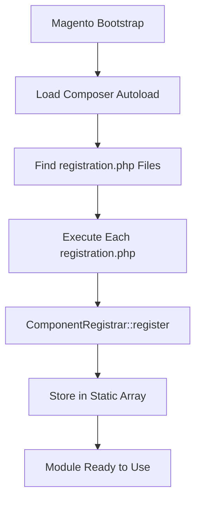

# 📝 The `registration.php` File

> Complete Guide to Module Registration in Magento 2

---

## 📑 Table of Contents

1. [Introduction](#1-introduction)
2. [File Location](#2-file-location)
3. [Basic Code](#3-basic-code)
4. [Code Breakdown](#4-code-breakdown)
5. [ComponentRegistrar Class](#5-componentregistrar-class)
6. [Component Types](#6-component-types)
7. [Loading Mechanism](#7-loading-mechanism)
8. [Static Storage Pattern](#8-static-storage-pattern)
9. [Composer Integration](#9-composer-integration)
10. [Best Practices](#10-best-practices)
11. [Bad Practices](#11-bad-practices)
12. [Common Errors](#12-common-errors)
13. [Advanced Topics](#13-advanced-topics)

---

## 1. Introduction

### What is `registration.php`?

`registration.php` is the **first file** Magento reads when loading any component (module, theme, language, library).

### Why is it Required?

| Without `registration.php` | With `registration.php` |
|---------------------------|-------------------------|
| ❌ Magento ignores the module | ✅ Magento recognizes the module |
| ❌ Module won't appear in list | ✅ Appears in `module:status` |
| ❌ Cannot be enabled/disabled | ✅ Full management capability |

### Registration Flow



---

## 2. File Location

### Required Path

```
app/code/Vendor/ModuleName/registration.php
```

### Standard Module Structure

```
app/code/Vendor/ModuleName/
├── registration.php          ← (Required)
├── etc/
│   └── module.xml           ← (Required)
├── Controller/
├── Model/
├── Block/
└── view/
```

---

## 3. Basic Code

```php
<?php
/**
 * Module registration file
 */
declare(strict_types=1);

use Magento\Framework\Component\ComponentRegistrar;

ComponentRegistrar::register(
    ComponentRegistrar::MODULE,
    'Vendor_ModuleName',
    __DIR__
);
```

---

## 4. Code Breakdown

### Line 1: `<?php`

PHP opening tag.

### Line 2-4: DocBlock (Optional)

```php
/**
 * Module registration file
 */
```

### Line 5: `declare(strict_types=1)`

```php
declare(strict_types=1);
```

| Setting | Effect |
|---------|--------|
| `strict_types=0` | Automatic type conversion |
| `strict_types=1` | Strict type checking - throws TypeError |

### Line 6: `use` Statement

```php
use Magento\Framework\Component\ComponentRegistrar;
```

Imports the `ComponentRegistrar` class.

### Lines 7-11: Registration Call

```php
ComponentRegistrar::register(
    ComponentRegistrar::MODULE,    // Component type
    'Vendor_ModuleName',           // Component name
    __DIR__                        // Component path
);
```

| Parameter | Description |
|-----------|-------------|
| `ComponentRegistrar::MODULE` | Type constant = "module" |
| `'Vendor_ModuleName'` | Unique identifier (format: `Vendor_Module`) |
| `__DIR__` | Current directory path |

---

## 5. ComponentRegistrar Class

### Location

```
vendor/magento/framework/Component/ComponentRegistrar.php
```

### Class Constants

```php
class ComponentRegistrar
{
    const MODULE = 'module';
    const LIBRARY = 'library';
    const THEME = 'theme';
    const LANGUAGE = 'language';
}
```

### Main Methods

#### `register()`

```php
public static function register(
    string $type,
    string $componentName,
    string $path
): void
```

Registers a component in the static storage.

#### `getPaths()`

```php
public static function getPaths(string $type): array
```

Returns all registered components of a specific type.

```php
// Example
$modules = ComponentRegistrar::getPaths(ComponentRegistrar::MODULE);
// Returns: ['Vendor_Module' => '/path/to/module', ...]
```

#### `getPath()`

```php
public static function getPath(string $type, string $componentName): ?string
```

Returns the path of a specific component.

```php
// Example
$path = ComponentRegistrar::getPath(
    ComponentRegistrar::MODULE,
    'Magento_Catalog'
);
// Returns: '/var/www/html/vendor/magento/module-catalog'
```

---

## 6. Component Types

### 1. Module

```php
ComponentRegistrar::register(
    ComponentRegistrar::MODULE,
    'Vendor_ModuleName',
    __DIR__
);
```

### 2. Theme

```php
ComponentRegistrar::register(
    ComponentRegistrar::THEME,
    'frontend/Vendor/theme-name',
    __DIR__
);
```

### 3. Language Pack

```php
ComponentRegistrar::register(
    ComponentRegistrar::LANGUAGE,
    'vendor_language',
    __DIR__
);
```

### 4. Library

```php
ComponentRegistrar::register(
    ComponentRegistrar::LIBRARY,
    'vendor/library-name',
    __DIR__
);
```

---

## 7. Loading Mechanism

### Composer Autoload Method (Recommended)

When installing via `composer require`:

```json
{
    "autoload": {
        "files": ["registration.php"],
        "psr-4": {
            "Vendor\\ModuleName\\": ""
        }
    }
}
```

Magento loads through:
```
vendor/composer/autoload_files.php
```

### Glob Pattern Method (app/code)

For modules in `app/code/`:

```php
// app/etc/NonComposerComponentRegistration.php
$pattern = BP . '/app/code/*/*/registration.php';
foreach (glob($pattern) as $file) {
    include $file;
}
```

The pattern `app/code/*/*/registration.php` finds all modules.

---

## 8. Static Storage Pattern

### How It Works

```php
class ComponentRegistrar
{
    private static array $paths = [
        self::MODULE => [],
        self::LIBRARY => [],
        self::THEME => [],
        self::LANGUAGE => []
    ];

    public static function register(
        string $type,
        string $componentName,
        string $path
    ): void {
        self::$paths[$type][$componentName] = $path;
    }
}
```

### Why Static?

| Benefit | Explanation |
|---------|-------------|
| **Fast access** | No instantiation needed |
| **Single source** | One shared registry across app |
| **Early loading** | Available before DI container |

---

## 9. Composer Integration

### composer.json for a Module

```json
{
    "name": "vendor/module-name",
    "description": "My Magento 2 Module",
    "type": "magento2-module",
    "version": "1.0.0",
    "license": "proprietary",
    "require": {
        "php": ">=8.1",
        "magento/framework": "*"
    },
    "autoload": {
        "files": [
            "registration.php"
        ],
        "psr-4": {
            "Vendor\\ModuleName\\": ""
        }
    }
}
```

### Key Fields

| Field | Value |
|-------|-------|
| `type` | `magento2-module` |
| `autoload.files` | Includes `registration.php` |
| `autoload.psr-4` | Class autoloading |

---

## 10. Best Practices

### ✅ 1. Use `declare(strict_types=1)`

```php
<?php
declare(strict_types=1);
```

### ✅ 2. Keep It Simple

```php
// ✅ Only registration
ComponentRegistrar::register(...);

// ❌ No business logic here
$product = loadProduct(); // Wrong!
```

### ✅ 3. Use Standard Naming

```
Vendor_ModuleName    ← Correct
vendor_modulename    ← Wrong (case matters)
VendorModuleName     ← Wrong (missing underscore)
```

### ✅ 4. One Module = One registration.php

Never register multiple modules in one file.

---

## 11. Bad Practices

### ❌ 1. Logic in registration.php

```php
// ❌ Wrong!
<?php
if (checkSomething()) {
    ComponentRegistrar::register(...);
}
```

### ❌ 2. Duplicate Names

```php
// Module A
ComponentRegistrar::register(MODULE, 'Vendor_Sample', ...);

// Module B - ❌ Conflict!
ComponentRegistrar::register(MODULE, 'Vendor_Sample', ...);
```

### ❌ 3. Wrong Naming Format

```php
// ❌ Wrong - lowercase
ComponentRegistrar::register(MODULE, 'vendor_module', ...);

// ❌ Wrong - no underscore
ComponentRegistrar::register(MODULE, 'VendorModule', ...);
```

---

## 12. Common Errors

### Error 1: Module Not Found

**Cause:** `registration.php` missing or incorrect path.

**Solution:**
```bash
# Verify file exists
ls app/code/Vendor/Module/registration.php

# Refresh autoloader
composer dump-autoload
bin/magento setup:upgrade
```

### Error 2: Class Not Found

**Cause:** PSR-4 namespace mismatch.

**Check:**
```php
// Filename: app/code/Vendor/Module/Model/Entity.php
namespace Vendor\Module\Model;  // Must match path
```

### Error 3: Duplicate Component

```
Exception: Component 'Vendor_Module' already registered
```

**Solution:** Ensure unique module names.

---

## 13. Advanced Topics

### Debug Registered Modules

```php
use Magento\Framework\Component\ComponentRegistrar;

$modules = ComponentRegistrar::getPaths(ComponentRegistrar::MODULE);
print_r($modules);
```

### CLI Commands

```bash
# List modules
bin/magento module:status

# Enable module
bin/magento module:enable Vendor_Module

# Disable module
bin/magento module:disable Vendor_Module
```

### Find Module Path Programmatically

```php
use Magento\Framework\Module\Dir;

class MyClass
{
    public function __construct(
        private Dir $moduleDir
    ) {}

    public function getModuleEtcPath(): string
    {
        return $this->moduleDir->getDir('Vendor_Module', Dir::MODULE_ETC_DIR);
    }
}
```

---

## 📌 Summary

| Item | Value |
|------|-------|
| **File** | `registration.php` |
| **Location** | Module root directory |
| **Purpose** | Register module with Magento |
| **Class** | `ComponentRegistrar` |
| **Required** | ✅ Yes (without it, module is invisible) |

---

## ➡️ [Next: module.xml](./Day-02-Module-XML/README.md) | [🏠 Home](../README.md)
