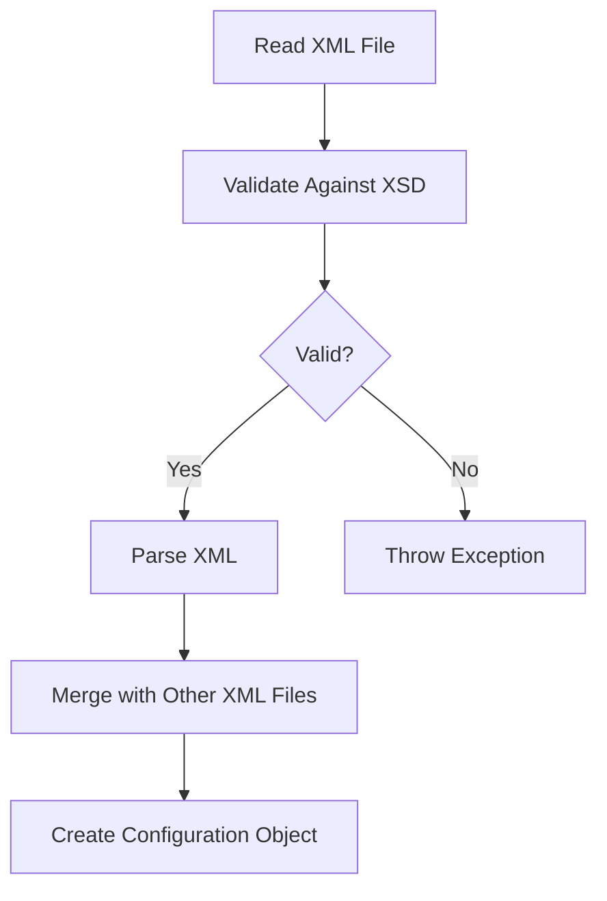
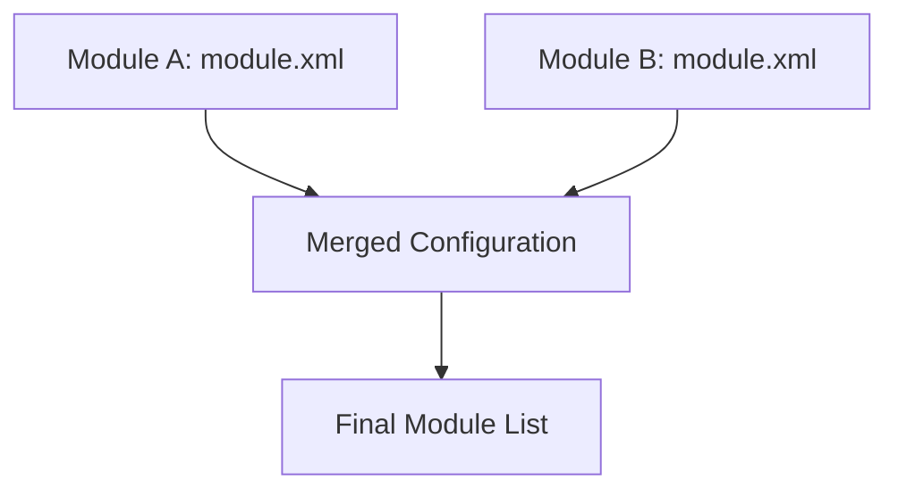
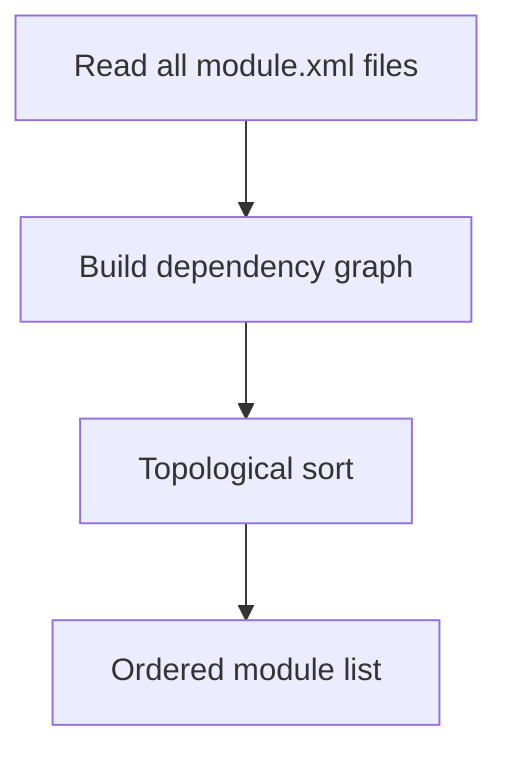

# 📦 The `module.xml` File

> Complete Guide to Module Configuration in Magento 2

---

## 📑 Table of Contents

1. [Introduction](#1-introduction)
2. [File Location](#2-file-location)
3. [Basic Code](#3-basic-code)
4. [XML Handling in Magento](#4-xml-handling-in-magento)
5. [XSD Schema](#5-xsd-schema)
6. [Elements](#6-elements)
7. [Attributes](#7-attributes)
8. [Module Dependencies](#8-module-dependencies)
9. [XML Merging](#9-xml-merging)
10. [Module Loading Order](#10-module-loading-order)
11. [Best Practices](#11-best-practices)
12. [Common Errors](#12-common-errors)
13. [Advanced Topics](#13-advanced-topics)

---

## 1. Introduction

### What is `module.xml`?

`module.xml` is the **declaration file** that tells Magento:
- The module's name
- Its version (deprecated but still used)
- Dependencies on other modules

### Relationship with registration.php

| File | Purpose |
|------|---------|
| `registration.php` | Tells Magento **where** the module is |
| `module.xml` | Tells Magento **what** the module is and its requirements |

---

## 2. File Location

### Required Path

```
app/code/Vendor/ModuleName/etc/module.xml
```

### Minimum Module Structure

```
app/code/Vendor/ModuleName/
├── registration.php    ← Required
└── etc/
    └── module.xml      ← Required
```

---

## 3. Basic Code

### Minimal Version

```xml
<?xml version="1.0"?>
<config xmlns:xsi="http://www.w3.org/2001/XMLSchema-instance"
        xsi:noNamespaceSchemaLocation="urn:magento:framework:Module/etc/module.xsd">
    <module name="Vendor_ModuleName"/>
</config>
```

### With Dependencies

```xml
<?xml version="1.0"?>
<config xmlns:xsi="http://www.w3.org/2001/XMLSchema-instance"
        xsi:noNamespaceSchemaLocation="urn:magento:framework:Module/etc/module.xsd">
    <module name="Vendor_ModuleName">
        <sequence>
            <module name="Magento_Catalog"/>
            <module name="Magento_Customer"/>
        </sequence>
    </module>
</config>
```

---

## 4. XML Handling in Magento

### How Magento Processes XML



### Key Classes

| Class | Purpose |
|-------|---------|
| `Magento\Framework\Config\Dom` | XML parsing and merging |
| `Magento\Framework\Config\Dom\UrnResolver` | URN to file path resolution |
| `Magento\Framework\Config\Validated\Mandatory` | Schema validation |

### URN Resolution

```
urn:magento:framework:Module/etc/module.xsd
         ↓ resolves to ↓
vendor/magento/framework/Module/etc/module.xsd
```

---

## 5. XSD Schema

### Schema Location

```
vendor/magento/framework/Module/etc/module.xsd
```

### Schema Content

```xml
<?xml version="1.0" encoding="UTF-8"?>
<xs:schema xmlns:xs="http://www.w3.org/2001/XMLSchema">
    <xs:element name="config">
        <xs:complexType>
            <xs:sequence>
                <xs:element name="module" maxOccurs="unbounded">
                    <xs:complexType>
                        <xs:sequence>
                            <xs:element name="sequence" minOccurs="0">
                                <xs:complexType>
                                    <xs:sequence>
                                        <xs:element name="module" maxOccurs="unbounded">
                                            <xs:complexType>
                                                <xs:attribute name="name" type="xs:string" use="required"/>
                                            </xs:complexType>
                                        </xs:element>
                                    </xs:sequence>
                                </xs:complexType>
                            </xs:element>
                        </xs:sequence>
                        <xs:attribute name="name" type="moduleName" use="required"/>
                        <xs:attribute name="setup_version" type="xs:string"/>
                    </xs:complexType>
                </xs:element>
            </xs:sequence>
        </xs:complexType>
    </xs:element>

    <xs:simpleType name="moduleName">
        <xs:restriction base="xs:string">
            <xs:pattern value="[A-Z][a-zA-Z0-9]*_[A-Z][a-zA-Z0-9]*"/>
        </xs:restriction>
    </xs:simpleType>
</xs:schema>
```

### Module Name Pattern

```
[A-Z][a-zA-Z0-9]*_[A-Z][a-zA-Z0-9]*

Examples:
✅ Vendor_Module
✅ MyCompany_AdvancedSearch
❌ vendor_module (lowercase)
❌ VendorModule (no underscore)
```

---

## 6. Elements

### Element Reference

| Element | Description | Parent | Required |
|---------|-------------|--------|----------|
| `<config>` | Root element | - | ✅ |
| `<module>` | Module declaration | config | ✅ |
| `<sequence>` | Dependencies container | module | ❌ |
| `<module>` | Dependency reference | sequence | ❌ |

### `<config>` Element

```xml
<config xmlns:xsi="http://www.w3.org/2001/XMLSchema-instance"
        xsi:noNamespaceSchemaLocation="urn:magento:framework:Module/etc/module.xsd">
```

| Attribute | Purpose |
|-----------|---------|
| `xmlns:xsi` | XML Schema Instance namespace |
| `xsi:noNamespaceSchemaLocation` | Path to XSD schema |

### `<module>` Element

```xml
<module name="Vendor_ModuleName">
    <!-- Optional sequence -->
</module>
```

### `<sequence>` Element

```xml
<sequence>
    <module name="Magento_Catalog"/>
    <module name="Magento_Customer"/>
</sequence>
```

Specifies modules that must load **before** this module.

---

## 7. Attributes

### Attribute Reference

| Attribute | Element | Description | Required |
|-----------|---------|-------------|----------|
| `name` | module (root) | Module identifier | ✅ |
| `setup_version` | module (root) | Version (deprecated) | ❌ |
| `name` | module (in sequence) | Dependency name | ✅ |

### `name` Attribute

```xml
<module name="Vendor_ModuleName"/>
```

- Must match `registration.php` name
- Format: `Vendor_ModuleName`
- Case-sensitive

### `setup_version` Attribute (Deprecated)

```xml
<module name="Vendor_ModuleName" setup_version="1.0.0"/>
```

> **Note:** Use `db_schema.xml` and Data Patches instead in Magento 2.3+.

---

## 8. Module Dependencies

### Hard Dependencies (sequence)

Must load before your module:

```xml
<module name="Vendor_ModuleName">
    <sequence>
        <module name="Magento_Catalog"/>
    </sequence>
</module>
```

### Soft Dependencies (composer require)

Recommended but not enforced in loading order:

```json
{
    "require": {
        "magento/module-catalog": "*"
    }
}
```

### Comparison

| Type | Defined In | Effect |
|------|------------|--------|
| **Hard (sequence)** | module.xml | Enforces load order |
| **Soft (require)** | composer.json | Ensures installation |

### When to Use Sequence

Use `<sequence>` when your module:
- Extends another module's classes
- Uses another module's layouts
- Overrides another module's configuration
- Depends on another module's database tables

---

## 9. XML Merging

### How Merging Works



### Merging Rules

| Scenario | Result |
|----------|--------|
| Same module, different sequences | Sequences are combined |
| Conflicting configurations | Later module wins |
| Multiple modules | All registered in order |

---

## 10. Module Loading Order

### Loading Process



### Key Classes

```php
// Module list management
Magento\Framework\Module\ModuleList

// Loading from files
Magento\Framework\Module\ModuleList\Loader

// Sorting by dependencies
Magento\Framework\Module\ModuleList\Sorter
```

### View Module Order

```sql
SELECT * FROM setup_module ORDER BY module;
```

Or check `app/etc/config.php`:

```php
return [
    'modules' => [
        'Magento_Store' => 1,
        'Magento_Catalog' => 1,
        'Vendor_ModuleName' => 1,
    ]
];
```

---

## 11. Best Practices

### ✅ 1. Minimal Dependencies

```xml
<!-- ✅ Only what you need -->
<sequence>
    <module name="Magento_Catalog"/>
</sequence>

<!-- ❌ Too many dependencies -->
<sequence>
    <module name="Magento_Catalog"/>
    <module name="Magento_Customer"/>
    <module name="Magento_Sales"/>
    <module name="Magento_Quote"/>
    <!-- ... many more -->
</sequence>
```

### ✅ 2. Use Composer for Installation Dependencies

```json
{
    "require": {
        "magento/module-catalog": "*"
    }
}
```

### ✅ 3. Use Valid XSD Schema

```xml
xsi:noNamespaceSchemaLocation="urn:magento:framework:Module/etc/module.xsd"
```

---

## 12. Common Errors

### Error 1: Invalid Module Name

```
Invalid module name: vendor_module
```

**Solution:** Use correct format `Vendor_Module`.

### Error 2: Circular Dependency

```
Circular dependency detected: A -> B -> C -> A
```

**Solution:** Review and restructure dependencies.

### Error 3: Dependency Not Found

```
Cannot use module "Vendor_Other" as a dependency
```

**Solution:** Ensure the dependency is installed and enabled.

### Error 4: XML Validation Error

```
Validation failed for file: module.xml
```

**Solution:** Validate against XSD schema.

---

## 13. Advanced Topics

### Get Module Version

```php
use Magento\Framework\Module\ModuleListInterface;

class Example
{
    public function __construct(
        private ModuleListInterface $moduleList
    ) {}

    public function getVersion(): string
    {
        $module = $this->moduleList->getOne('Vendor_ModuleName');
        return $module['setup_version'] ?? 'unknown';
    }
}
```

### Check if Module Enabled

```php
use Magento\Framework\Module\Manager;

class Example
{
    public function __construct(
        private Manager $moduleManager
    ) {}

    public function isEnabled(): bool
    {
        return $this->moduleManager->isEnabled('Vendor_ModuleName');
    }
}
```

### CLI Commands

```bash
# List all modules
bin/magento module:status

# Enable module
bin/magento module:enable Vendor_ModuleName

# Disable module
bin/magento module:disable Vendor_ModuleName

# Show enabled modules
bin/magento module:status --enabled

# Show disabled modules
bin/magento module:status --disabled
```

---

## 📌 Summary

| Item | Value |
|------|-------|
| **File** | `etc/module.xml` |
| **XSD** | `urn:magento:framework:Module/etc/module.xsd` |
| **Root Element** | `<config>` |
| **Required Attribute** | `name` on `<module>` |
| **Dependencies** | `<sequence>` element |

---

## ⬅️ [Previous](./Day-01-Registration/README.md) | [🏠 Home](../README.md) | [Next ➡️](./Day-03-ROUTES/README.md)
