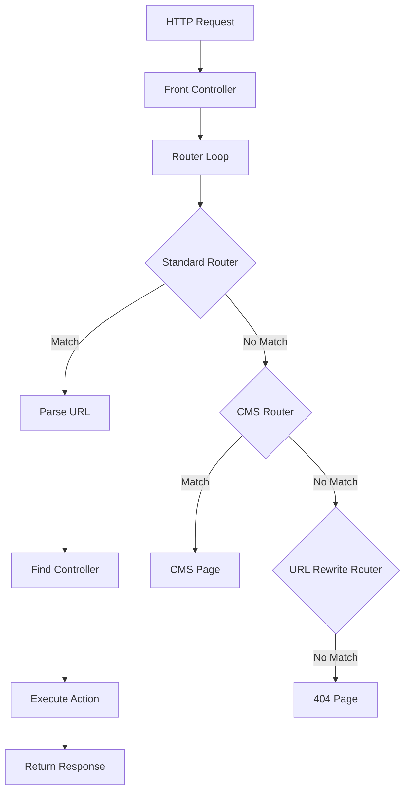

# 🛣️ The Routes (`routes.xml`)

> Complete Guide to the Routing System in Magento 2

---

## 📑 Table of Contents

1. [Introduction](#1-introduction)
2. [How Routing Works](#2-how-routing-works)
3. [File Location](#3-file-location)
4. [Basic Code](#4-basic-code)
5. [XSD Schema](#5-xsd-schema)
6. [Elements](#6-elements)
7. [Attributes](#7-attributes)
8. [Router Types](#8-router-types)
9. [URL Structure](#9-url-structure)
10. [Route Merging](#10-route-merging)
11. [Best Practices](#11-best-practices)
12. [Common Errors](#12-common-errors)
13. [Advanced Topics](#13-advanced-topics)

---

## 1. Introduction

### What is `routes.xml`?

`routes.xml` is the configuration file that maps **URLs to Controllers** in Magento 2.

### How It Works

```
URL: https://store.com/helloworld/index/display
                        ↓
                   routes.xml maps "helloworld" to
                        ↓
                Controller/Index/Display.php
```

---

## 2. How Routing Works

### Request Flow



### Router Chain

```php
// Router execution order
1. Magento\Framework\App\Router\Base         // Standard router
2. Magento\Cms\Controller\Router             // CMS pages
3. Magento\UrlRewrite\Controller\Router      // URL rewrites
4. Magento\Framework\App\Router\DefaultRouter // 404
```

---

## 3. File Location

### Frontend Routes

```
app/code/Vendor/ModuleName/etc/frontend/routes.xml
```

### Admin Routes

```
app/code/Vendor/ModuleName/etc/adminhtml/routes.xml
```

### Structure

```
etc/
├── frontend/
│   └── routes.xml      # Frontend routes
├── adminhtml/
│   └── routes.xml      # Admin routes
└── module.xml
```

---

## 4. Basic Code

### Frontend Route

```xml
<?xml version="1.0"?>
<config xmlns:xsi="http://www.w3.org/2001/XMLSchema-instance"
        xsi:noNamespaceSchemaLocation="urn:magento:framework:App/etc/routes.xsd">
    <router id="standard">
        <route id="helloworld" frontName="helloworld">
            <module name="Vendor_ModuleName"/>
        </route>
    </router>
</config>
```

### Admin Route

```xml
<?xml version="1.0"?>
<config xmlns:xsi="http://www.w3.org/2001/XMLSchema-instance"
        xsi:noNamespaceSchemaLocation="urn:magento:framework:App/etc/routes.xsd">
    <router id="admin">
        <route id="myadmin" frontName="myadmin">
            <module name="Vendor_ModuleName"/>
        </route>
    </router>
</config>
```

### Code Breakdown

```xml
<router id="standard">
```
↳ Router type (standard for frontend, admin for backend)

```xml
<route id="helloworld" frontName="helloworld">
```
↳ `id`: Unique route identifier
↳ `frontName`: First part of URL

```xml
<module name="Vendor_ModuleName"/>
```
↳ Module containing the controllers

---

## 5. XSD Schema

### Schema Location

```
vendor/magento/framework/App/etc/routes.xsd
```

---

## 6. Elements

### Element Reference

| Element | Description | Parent | Required |
|---------|-------------|--------|----------|
| `<config>` | Root element | - | ✅ |
| `<router>` | Router definition | config | ✅ |
| `<route>` | Route definition | router | ✅ |
| `<module>` | Handler module | route | ✅ |

---

## 7. Attributes

### Complete Attribute Reference

| Attribute | Element | Description | Required | Values |
|-----------|---------|-------------|----------|--------|
| `id` | router | Router type | ✅ | `standard`, `admin` |
| `id` | route | Route identifier | ✅ | unique string |
| `frontName` | route | URL prefix | ✅ | lowercase string |
| `name` | module | Module name | ✅ | `Vendor_Module` |
| `before` | module | Load order before | ❌ | module name |
| `after` | module | Load order after | ❌ | module name |

### `frontName` Rules

```
✅ Correct:
- helloworld
- mymodule
- custom_route

❌ Wrong:
- HelloWorld (uppercase)
- hello-world (hyphen - avoid)
- hello world (spaces)
```

---

## 8. Router Types

### 1. Standard Router (`id="standard"`)

```xml
<router id="standard">
    <route id="helloworld" frontName="helloworld">
        <module name="Vendor_ModuleName"/>
    </route>
</router>
```

**For Frontend URLs:**
- `https://store.com/helloworld`
- `https://store.com/helloworld/index`
- `https://store.com/helloworld/index/index`

### 2. Admin Router (`id="admin"`)

```xml
<router id="admin">
    <route id="myadmin" frontName="myadmin">
        <module name="Vendor_ModuleName"/>
    </route>
</router>
```

**For Admin URLs:**
- `https://store.com/admin/myadmin`
- `https://store.com/admin/myadmin/index`
- `https://store.com/admin/myadmin/entity/edit`

### Comparison

| Property | Standard | Admin |
|----------|----------|-------|
| Area | frontend | adminhtml |
| URL Prefix | frontName directly | admin/{frontName} |
| Authentication | No | Yes (required) |
| ACL | No | Yes (required) |
| Controller Path | Controller/ | Controller/Adminhtml/ |

---

## 9. URL Structure

### Complete Structure

```
https://store.com/{frontName}/{controller}/{action}/{param}/{value}
                      ↓            ↓          ↓        ↓       ↓
                  Route ID    Folder     PHP File   Key   Value
```

### Examples

| URL | Controller Path |
|-----|-----------------|
| `/helloworld` | `Controller/Index/Index.php` |
| `/helloworld/index` | `Controller/Index/Index.php` |
| `/helloworld/index/index` | `Controller/Index/Index.php` |
| `/helloworld/test` | `Controller/Test/Index.php` |
| `/helloworld/test/display` | `Controller/Test/Display.php` |
| `/helloworld/customer/view` | `Controller/Customer/View.php` |

### Rules

```
1. If controller not specified → uses "index"
2. If action not specified → uses "index"
3. Controller folder = ucfirst(controller from URL)
4. Action file = ucfirst(action from URL).php
```

### URL Parameters

```
URL: /helloworld/index/view/id/5/name/test
                              ↓    ↓
Parameters: ['id' => '5', 'name' => 'test']
```

```php
// In Controller
$id = $this->getRequest()->getParam('id');    // '5'
$name = $this->getRequest()->getParam('name'); // 'test'
```

---

## 10. Route Merging

### Override Route from Another Module

```xml
<!-- Add your module to handle an existing route -->
<config>
    <router id="standard">
        <route id="catalog" frontName="catalog">
            <module name="Vendor_ExtendCatalog" before="Magento_Catalog"/>
        </route>
    </router>
</config>
```

### Module Order

```xml
<!-- Your module is checked first -->
<module name="Vendor_Module" before="Magento_Catalog"/>

<!-- Your module is checked after Magento_Catalog -->
<module name="Vendor_Module" after="Magento_Catalog"/>

<!-- Without specification - follows module.xml sequence -->
<module name="Vendor_Module"/>
```

---

## 11. Best Practices

### ✅ 1. Use Unique frontName

```xml
<!-- ✅ Correct - clear unique name -->
<route id="vendor_products" frontName="vendor-products">

<!-- ❌ Wrong - may conflict with other modules -->
<route id="products" frontName="products">
```

### ✅ 2. Use Correct Action Interfaces

```php
// ✅ GET request
class View implements HttpGetActionInterface

// ✅ POST request
class Save implements HttpPostActionInterface
```

### ✅ 3. Admin Controllers Extend Backend\App\Action

```php
// ✅ Correct
class Index extends \Magento\Backend\App\Action
```

### ✅ 4. Always Define ADMIN_RESOURCE

```php
class Index extends Action
{
    const ADMIN_RESOURCE = 'Vendor_ModuleName::resource_id';
}
```

---

## 12. Common Errors

### Error 1: 404 Not Found

**Possible causes:**
1. frontName is wrong
2. Controller doesn't exist
3. routes.xml in wrong location

**Solution:**
```bash
bin/magento cache:flush
ls app/code/Vendor/Module/etc/frontend/routes.xml
```

### Error 2: Access Denied (Admin)

**Cause:** ADMIN_RESOURCE not defined or incorrect

**Solution:**
```php
const ADMIN_RESOURCE = 'Vendor_Module::correct_resource';
```

### Error 3: Class Not Found

**Cause:** Controller in wrong path

**Solution:** Verify structure:
```
Controller/
├── Index/
│   └── Index.php      # namespace: Vendor\Module\Controller\Index
└── Adminhtml/
    └── Entity/
        └── Index.php  # namespace: Vendor\Module\Controller\Adminhtml\Entity
```

---

## 13. Advanced Topics

### Custom Router

```php
<?php
namespace Vendor\Module\Controller;

use Magento\Framework\App\ActionFactory;
use Magento\Framework\App\RequestInterface;
use Magento\Framework\App\RouterInterface;

class CustomRouter implements RouterInterface
{
    public function __construct(
        private ActionFactory $actionFactory
    ) {}

    public function match(RequestInterface $request)
    {
        $identifier = trim($request->getPathInfo(), '/');

        if (strpos($identifier, 'custom-url') !== false) {
            $request->setModuleName('vendor_module');
            $request->setControllerName('index');
            $request->setActionName('custom');

            return $this->actionFactory->create(
                \Magento\Framework\App\Action\Forward::class
            );
        }

        return null;
    }
}
```

### Register Custom Router

```xml
<!-- etc/frontend/di.xml -->
<type name="Magento\Framework\App\RouterList">
    <arguments>
        <argument name="routerList" xsi:type="array">
            <item name="custom" xsi:type="array">
                <item name="class" xsi:type="string">Vendor\Module\Controller\CustomRouter</item>
                <item name="disable" xsi:type="boolean">false</item>
                <item name="sortOrder" xsi:type="string">25</item>
            </item>
        </argument>
    </arguments>
</type>
```

---

## 📌 Summary

| Item | Value |
|------|-------|
| **File** | `etc/frontend/routes.xml` or `etc/adminhtml/routes.xml` |
| **XSD** | `urn:magento:framework:App/etc/routes.xsd` |
| **Router IDs** | `standard` (frontend), `admin` (backend) |
| **URL Format** | `/{frontName}/{controller}/{action}` |

---

## ⬅️ [Previous](./Day-02-Module-XML/README.md) | [🏠 Home](../README.md) | [Next ➡️](./Day-04-Controllers/README.md)
