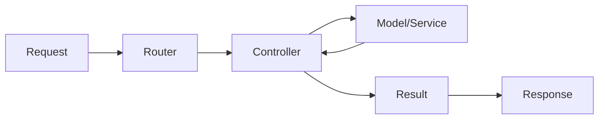

# 🎮 Controllers

> Complete Guide to Controllers in Magento 2

---

## 📑 Table of Contents

1. [Introduction](#1-introduction)
2. [File Location](#2-file-location)
3. [Action Interfaces](#3-action-interfaces)
4. [Frontend Controllers](#4-frontend-controllers)
5. [Admin Controllers](#5-admin-controllers)
6. [Request & Response](#6-request--response)
7. [Result Types](#7-result-types)
8. [Forward & Redirect](#8-forward--redirect)
9. [Dependency Injection](#9-dependency-injection)
10. [ACL for Admin](#10-acl-for-admin)
11. [Best Practices](#11-best-practices)
12. [Advanced Topics](#12-advanced-topics)

---

## 1. Introduction

### What is a Controller?

A Controller is responsible for:
- **Receiving** the HTTP Request
- **Processing** the request (via Models/Services)
- **Returning** an appropriate Response

### The Pattern



---

## 2. File Location

### Structure

```
app/code/Vendor/ModuleName/Controller/
├── Index/                      # Frontend controllers
│   ├── Index.php              # /modulename/index/index
│   ├── View.php               # /modulename/index/view
│   └── Save.php               # /modulename/index/save
│
└── Adminhtml/                  # Admin controllers
    └── Entity/
        ├── Index.php          # /admin/modulename/entity/index
        ├── Edit.php           # /admin/modulename/entity/edit
        ├── Save.php           # /admin/modulename/entity/save
        └── Delete.php         # /admin/modulename/entity/delete
```

### Naming Conventions

```
URL: /{frontName}/{controller}/{action}

Controller Path: Controller/{Controller}/{Action}.php

Example:
URL: /helloworld/customer/view
Path: Controller/Customer/View.php
Class: Vendor\Module\Controller\Customer\View
```

---

## 3. Action Interfaces

### Available Interfaces

| Interface | HTTP Method | Usage |
|-----------|-------------|-------|
| `HttpGetActionInterface` | GET | Display pages, read data |
| `HttpPostActionInterface` | POST | Submit forms, create data |
| `HttpPutActionInterface` | PUT | Update data |
| `HttpDeleteActionInterface` | DELETE | Delete data |

### Interface Locations

```php
Magento\Framework\App\Action\HttpGetActionInterface
Magento\Framework\App\Action\HttpPostActionInterface
Magento\Framework\App\Action\HttpPutActionInterface
Magento\Framework\App\Action\HttpDeleteActionInterface
```

### Why Use Them?

```php
// ✅ Specifies HTTP method - more secure
class View implements HttpGetActionInterface

// ❌ Accepts any method - less secure
class View extends Action
```

---

## 4. Frontend Controllers

### Complete Code

```php
<?php
declare(strict_types=1);

namespace Vendor\ModuleName\Controller\Index;

use Magento\Framework\App\Action\HttpGetActionInterface;
use Magento\Framework\App\RequestInterface;
use Magento\Framework\View\Result\Page;
use Magento\Framework\View\Result\PageFactory;

class Index implements HttpGetActionInterface
{
    public function __construct(
        private PageFactory $pageFactory,
        private RequestInterface $request
    ) {}

    public function execute(): Page
    {
        $id = $this->request->getParam('id');

        $page = $this->pageFactory->create();
        $page->getConfig()->getTitle()->set(__('My Page Title'));

        return $page;
    }
}
```

### POST Action

```php
<?php
declare(strict_types=1);

namespace Vendor\ModuleName\Controller\Index;

use Magento\Framework\App\Action\HttpPostActionInterface;
use Magento\Framework\App\RequestInterface;
use Magento\Framework\Controller\Result\RedirectFactory;
use Magento\Framework\Controller\Result\Redirect;
use Magento\Framework\Message\ManagerInterface;
use Magento\Framework\Data\Form\FormKey\Validator;

class Save implements HttpPostActionInterface
{
    public function __construct(
        private RequestInterface $request,
        private RedirectFactory $redirectFactory,
        private ManagerInterface $messageManager,
        private Validator $formKeyValidator
    ) {}

    public function execute(): Redirect
    {
        $redirect = $this->redirectFactory->create();

        // Validate Form Key (CSRF protection)
        if (!$this->formKeyValidator->validate($this->request)) {
            $this->messageManager->addErrorMessage(__('Invalid form key'));
            return $redirect->setPath('*/*/');
        }

        try {
            $data = $this->request->getPostValue();
            // Process data...

            $this->messageManager->addSuccessMessage(__('Data saved successfully'));
            return $redirect->setPath('*/*/index');

        } catch (\Exception $e) {
            $this->messageManager->addErrorMessage($e->getMessage());
            return $redirect->setPath('*/*/');
        }
    }
}
```

---

## 5. Admin Controllers

### Complete Code

```php
<?php
declare(strict_types=1);

namespace Vendor\ModuleName\Controller\Adminhtml\Entity;

use Magento\Backend\App\Action;
use Magento\Backend\App\Action\Context;
use Magento\Framework\View\Result\Page;
use Magento\Framework\View\Result\PageFactory;

class Index extends Action
{
    /**
     * Authorization level - required!
     */
    public const ADMIN_RESOURCE = 'Vendor_ModuleName::entity_view';

    public function __construct(
        Context $context,
        private PageFactory $pageFactory
    ) {
        parent::__construct($context);
    }

    public function execute(): Page
    {
        $page = $this->pageFactory->create();

        $page->setActiveMenu('Vendor_ModuleName::entity');
        $page->getConfig()->getTitle()->prepend(__('Manage Entities'));
        $page->addBreadcrumb(__('Entities'), __('Entities'));

        return $page;
    }
}
```

---

## 6. Request & Response

### Request Object

```php
use Magento\Framework\App\RequestInterface;

class MyController
{
    public function __construct(
        private RequestInterface $request
    ) {}

    public function execute()
    {
        // GET parameter
        $id = $this->request->getParam('id');
        $id = $this->request->getParam('id', 'default_value');

        // POST data
        $postData = $this->request->getPostValue();
        $field = $this->request->getPost('field_name');

        // All parameters
        $params = $this->request->getParams();

        // Check method
        $isPost = $this->request->isPost();
        $isAjax = $this->request->isAjax();

        // Module/Controller/Action names
        $module = $this->request->getModuleName();
        $controller = $this->request->getControllerName();
        $action = $this->request->getActionName();
    }
}
```

---

## 7. Result Types

### Available Types

| Type | Usage | Factory |
|------|-------|---------|
| `Page` | HTML page | `PageFactory` |
| `Json` | JSON response | `JsonFactory` |
| `Redirect` | Redirect URL | `RedirectFactory` |
| `Forward` | Internal forward | `ForwardFactory` |
| `Raw` | Raw content | `RawFactory` |

### Page Result

```php
use Magento\Framework\View\Result\PageFactory;

public function execute()
{
    $page = $this->pageFactory->create();
    $page->getConfig()->getTitle()->set('Page Title');
    return $page;
}
```

### JSON Result

```php
use Magento\Framework\Controller\Result\JsonFactory;

public function execute()
{
    $result = $this->jsonFactory->create();
    return $result->setData([
        'success' => true,
        'message' => 'Data retrieved',
        'data' => ['id' => 1, 'name' => 'Test']
    ]);
}
```

### Redirect Result

```php
use Magento\Framework\Controller\Result\RedirectFactory;

public function execute()
{
    $redirect = $this->redirectFactory->create();
    return $redirect->setPath('module/controller/action', ['id' => 5]);
}
```

---

## 8. Forward & Redirect

### Forward (Internal - same request)

```php
use Magento\Framework\Controller\Result\ForwardFactory;

public function execute()
{
    $forward = $this->forwardFactory->create();
    return $forward
        ->setModule('module')
        ->setController('controller')
        ->setParams(['id' => 5])
        ->forward('newaction');
}
```

### Difference

| Property | Forward | Redirect |
|----------|---------|----------|
| New HTTP Request | ❌ No | ✅ Yes |
| URL Changes | ❌ No | ✅ Yes |
| Data Preserved | ✅ Yes | ❌ No |
| Performance | Faster | Slower |

---

## 9. Dependency Injection

### Constructor Injection

```php
public function __construct(
    private PageFactory $pageFactory,
    private EntityRepositoryInterface $entityRepository,
    private LoggerInterface $logger
) {}
```

---

## 10. ACL for Admin

### Define ACL in acl.xml

```xml
<!-- etc/acl.xml -->
<?xml version="1.0"?>
<config xmlns:xsi="http://www.w3.org/2001/XMLSchema-instance"
        xsi:noNamespaceSchemaLocation="urn:magento:framework:Acl/etc/acl.xsd">
    <acl>
        <resources>
            <resource id="Magento_Backend::admin">
                <resource id="Vendor_Module::top_level" title="My Module">
                    <resource id="Vendor_Module::entity" title="Entities">
                        <resource id="Vendor_Module::entity_view" title="View"/>
                        <resource id="Vendor_Module::entity_save" title="Save"/>
                        <resource id="Vendor_Module::entity_delete" title="Delete"/>
                    </resource>
                </resource>
            </resource>
        </resources>
    </acl>
</config>
```

### Use in Controller

```php
class Index extends Action
{
    public const ADMIN_RESOURCE = 'Vendor_Module::entity_view';
}
```

---

## 11. Best Practices

### ✅ 1. Keep Controllers Thin

```php
// ✅ Correct - thin controller
public function execute()
{
    $data = $this->request->getPostValue();
    $this->entityService->save($data);  // Business logic in Service
    return $this->redirect->setPath('*/*/');
}

// ❌ Wrong - fat controller
public function execute()
{
    // 100 lines of business logic
}
```

### ✅ 2. Use Action Interfaces

```php
// ✅ Modern
class View implements HttpGetActionInterface

// ❌ Deprecated
class View extends \Magento\Framework\App\Action\Action
```

### ✅ 3. CSRF Protection

```php
if (!$this->formKeyValidator->validate($this->request)) {
    throw new \Exception('Invalid form key');
}
```

---

## 12. Advanced Topics

### REST Controller

```php
class GetEntity implements HttpGetActionInterface
{
    public function __construct(
        private JsonFactory $jsonFactory,
        private EntityRepository $repository,
        private RequestInterface $request
    ) {}

    public function execute()
    {
        $result = $this->jsonFactory->create();

        try {
            $id = $this->request->getParam('id');
            $entity = $this->repository->getById($id);

            return $result->setData([
                'success' => true,
                'data' => $entity->getData()
            ]);
        } catch (\Exception $e) {
            return $result->setData([
                'success' => false,
                'message' => $e->getMessage()
            ]);
        }
    }
}
```

---

## 📌 Summary

| Item | Value |
|------|-------|
| **Path** | `Controller/` (Frontend) or `Controller/Adminhtml/` (Admin) |
| **Interfaces** | `HttpGetActionInterface`, `HttpPostActionInterface` |
| **Admin Base** | `Magento\Backend\App\Action` |
| **Method** | `execute()` |
| **ACL** | `ADMIN_RESOURCE` constant |

---

## ⬅️ [Previous](./03_ROUTES.md) | [🏠 Home](../MODULE_STRUCTURE_EN.md) | [Next ➡️](./05_MODELS.md)
