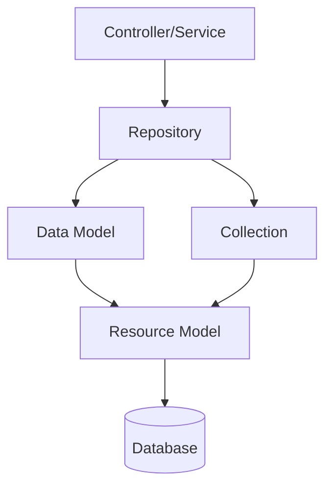
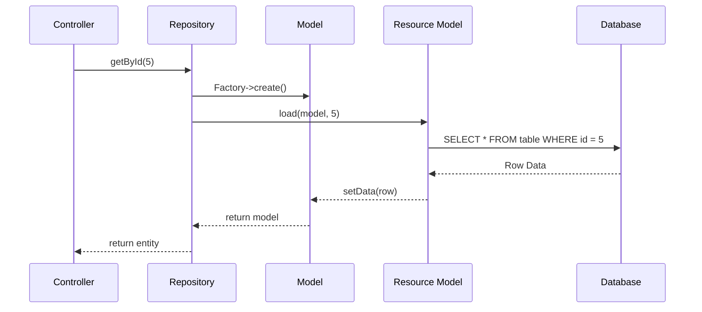

# 💾 Models and Data Layer

> Complete Guide to Models, ResourceModels, Repositories in Magento 2

---

## 📑 Table of Contents

1. [Introduction](#1-introduction)
2. [File Structure](#2-file-structure)
3. [Data Model](#3-data-model)
4. [Magic Methods vs Explicit Getters/Setters](#4-magic-methods-vs-explicit-getterssetters)
5. [Types of Models](#5-types-of-models)
6. [Resource Model](#6-resource-model)
7. [Collection](#7-collection)
8. [Repository Pattern](#8-repository-pattern)
9. [Data Interface](#9-data-interface)
10. [SearchCriteria](#10-searchcriteria)
11. [CRUD Operations](#11-crud-operations)
12. [Best Practices](#12-best-practices)
13. [Advanced Topics](#13-advanced-topics)
14. [How to Think When Building a Module](#14-how-to-think-when-building-a-module)

---

## 1. Introduction

### Data Layers in Magento 2



### Layer Responsibilities

| Layer              | Responsibility               |
| ------------------ | ---------------------------- |
| **Data Model**     | Data representation (Entity) |
| **Resource Model** | Database operations          |
| **Collection**     | Collection of Models         |
| **Repository**     | CRUD API layer               |

---

## 2. File Structure

```
app/code/Vendor/Module/
├── Api/
│   ├── Data/
│   │   └── EntityInterface.php        # Data interface
│   └── EntityRepositoryInterface.php  # Repository interface
│
├── Model/
│   ├── Entity.php                     # Data Model
│   ├── EntityRepository.php           # Repository Implementation
│   └── ResourceModel/
│       ├── Entity.php                 # Resource Model
│       └── Entity/
│           └── Collection.php         # Collection
│
└── etc/
    └── di.xml                         # Interface bindings
```

---

## 3. Data Model

### Complete Code

```php
<?php
declare(strict_types=1);

namespace Vendor\Module\Model;

use Magento\Framework\Model\AbstractModel;
use Magento\Framework\DataObject\IdentityInterface;
use Vendor\Module\Api\Data\EntityInterface;
use Vendor\Module\Model\ResourceModel\Entity as ResourceModel;

class Entity extends AbstractModel implements EntityInterface, IdentityInterface
{
    public const CACHE_TAG = 'vendor_module_entity';

    protected $_cacheTag = self::CACHE_TAG;
    protected $_eventPrefix = 'vendor_module_entity';
    protected $_eventObject = 'entity';

    protected function _construct(): void
    {
        $this->_init(ResourceModel::class);
    }

    public function getIdentities(): array
    {
        return [self::CACHE_TAG . '_' . $this->getId()];
    }

    // Getters and Setters
    public function getEntityId(): ?int
    {
        return $this->getData(self::ENTITY_ID) ? (int) $this->getData(self::ENTITY_ID) : null;
    }

    public function setEntityId(int $entityId): EntityInterface
    {
        return $this->setData(self::ENTITY_ID, $entityId);
    }

    public function getName(): ?string
    {
        return $this->getData(self::NAME);
    }

    public function setName(string $name): EntityInterface
    {
        return $this->setData(self::NAME, $name);
    }
}
```

### Code Breakdown

| Component         | Purpose                                                                        |
| ----------------- | ------------------------------------------------------------------------------ |
| `CACHE_TAG`       | Unique cache identifier for Full Page Cache invalidation                       |
| `$_cacheTag`      | Same as CACHE_TAG but as property                                              |
| `$_eventPrefix`   | Prefix for events like `vendor_module_entity_save_before`                      |
| `$_eventObject`   | Object name in event, accessible via `$observer->getEntity()`                  |
| `_construct()`    | Links Model to its Resource Model (note: single underscore, not `__construct`) |
| `getIdentities()` | Returns cache tags for cache invalidation                                      |

---

## 4. Magic Methods vs Explicit Getters/Setters

### ✨ Magic Methods - Built-in Feature

Magento provides **automatic getters and setters** for any column in your table:

```php
// Without defining any getter or setter!
$entity = $entityFactory->create();
$entity->setName('Ahmed');        // ✅ Works
$entity->setStatus(1);            // ✅ Works
echo $entity->getName();          // ✅ Works
echo $entity->getStatus();        // ✅ Works
```

### 🔧 How Magic Methods Work

The `AbstractModel` inherits from `DataObject`, which has the `__call()` magic method:

```php
// In Magento\Framework\DataObject
public function __call($method, $args)
{
    if (substr($method, 0, 3) === 'get') {
        // getName() → getData('name')
        $key = $this->_underscore(substr($method, 3));
        return $this->getData($key);
    }
    if (substr($method, 0, 3) === 'set') {
        // setName('x') → setData('name', 'x')
        $key = $this->_underscore(substr($method, 3));
        return $this->setData($key, $args[0] ?? null);
    }
}
```

### 🤔 Why Define Explicit Getters/Setters?

#### 1. Type Safety

```php
// Magic Method - No Type Checking
$entity->getName();  // Could return string, int, null, anything!

// Explicit Getter - With Type Declaration
public function getName(): ?string  // ← You control the return type
{
    return $this->getData('name');
}
```

#### 2. IDE Autocomplete

```php
// Magic Methods ❌
$entity->getNa...  // IDE won't suggest anything!

// Explicit Methods ✅
$entity->getNa...  // IDE suggests: getName()
```

#### 3. Interface Contract

```php
// In EntityInterface.php
interface EntityInterface
{
    public function getName(): ?string;
    public function setName(string $name): self;
}
```

When implementing `EntityInterface`, you **must** define these methods explicitly.

#### 4. Web API / REST

```php
// For REST API to work, getters must be explicit and defined in Interface
GET /rest/V1/entities/1
{
    "name": "Ahmed",  // ← Retrieved from getName()
    "status": 1       // ← Retrieved from getStatus()
}
```

#### 5. Custom Logic

```php
public function getFullName(): string
{
    // Custom logic, not just getData
    return $this->getData('first_name') . ' ' . $this->getData('last_name');
}

public function setStatus(int $status): self
{
    // Validation before saving
    if ($status < 0 || $status > 2) {
        throw new \InvalidArgumentException('Invalid status');
    }
    return $this->setData('status', $status);
}
```

### 📊 Comparison

| Feature             | Magic Methods   | Explicit Methods |
| ------------------- | --------------- | ---------------- |
| **Ease of writing** | ✅ Easier       | ❌ Requires code |
| **Type Safety**     | ❌ No           | ✅ Yes           |
| **IDE Support**     | ❌ No           | ✅ Yes           |
| **Web API**         | ❌ Won't work   | ✅ Works         |
| **Interface**       | ❌ Not possible | ✅ Possible      |
| **Custom Logic**    | ❌ No           | ✅ Yes           |

### 📝 When to Use Each

| Situation                       | Use                             |
| ------------------------------- | ------------------------------- |
| **Prototyping / Quick Testing** | Magic Methods ✅                |
| **Production Code**             | Explicit Methods ✅             |
| **Need Web API**                | Explicit Methods ✅ (Required!) |
| **Need IDE Support**            | Explicit Methods ✅             |

---

## 5. Types of Models

### ❓ Do You Need a Database Table?

**No!** Not all Models require a database table. There are **3 types of Models**:

### 1️⃣ Persisted Model (With Database Table)

The traditional Model that saves to database:

```php
class Entity extends AbstractModel
{
    protected function _construct(): void
    {
        $this->_init(ResourceModel::class);  // ← Linked to Resource Model
    }
}
```

### 2️⃣ DataObject Model (No Database Table)

Used as a **Data Container** or **Value Object**:

```php
<?php
namespace Vendor\Module\Model;

use Magento\Framework\DataObject;

class ShippingResult extends DataObject
{
    public function getPrice(): float
    {
        return (float) $this->getData('price');
    }

    public function setPrice(float $price): self
    {
        return $this->setData('price', $price);
    }

    public function getCarrierName(): string
    {
        return $this->getData('carrier_name');
    }

    public function setCarrierName(string $name): self
    {
        return $this->setData('carrier_name', $name);
    }
}
```

**Usage:**

```php
$result = new ShippingResult();
$result->setPrice(25.50);
$result->setCarrierName('DHL');

// Or using Factory
$result = $this->shippingResultFactory->create([
    'data' => [
        'price' => 25.50,
        'carrier_name' => 'DHL'
    ]
]);
```

### 3️⃣ POPO (Plain Old PHP Object)

Simple PHP class without any Magento inheritance:

```php
<?php
namespace Vendor\Module\Model;

class CalculationResult
{
    private float $total;
    private float $tax;
    private string $currency;

    public function __construct(float $total, float $tax, string $currency)
    {
        $this->total = $total;
        $this->tax = $tax;
        $this->currency = $currency;
    }

    public function getTotal(): float
    {
        return $this->total;
    }

    public function getTax(): float
    {
        return $this->tax;
    }

    public function getCurrency(): string
    {
        return $this->currency;
    }
}
```

### 📊 Types Comparison

| Type                 | Inherits From   | Has Table? | Use Case                         |
| -------------------- | --------------- | ---------- | -------------------------------- |
| **Persisted Model**  | `AbstractModel` | ✅ Yes     | Store data in DB                 |
| **DataObject Model** | `DataObject`    | ❌ No      | Data container / Transfer object |
| **POPO**             | Nothing         | ❌ No      | Business logic / Immutable data  |

### 🤔 When to Use Each Type

```
Do you need to save to Database?
    │
    ├── Yes ───► AbstractModel + ResourceModel + Table
    │
    └── No ───► DataObject or POPO
```

#### Use **Persisted Model** when:

- ✅ Need to save data in Database
- ✅ Need CRUD operations
- ✅ Data is permanent

**Examples:** `Customer`, `Product`, `Order`, `Banner`

#### Use **DataObject Model** when:

- ✅ Need to pass data between classes
- ✅ Don't need to save in DB
- ✅ Need flexibility

**Examples:** `ShippingResult`, `PaymentInfo`, `ValidationResult`

#### Use **POPO** when:

- ✅ Need Immutable object
- ✅ Need strong Type Safety
- ✅ Simple business logic

**Examples:** `Money`, `Address`, `Coordinates`

### 💡 Practical Example

Imagine a shipping calculation module:

```
Vendor/Shipping/
├── Model/
│   ├── Carrier.php              ← Persisted (carriers table)
│   ├── ShippingRate.php         ← DataObject (not saved)
│   └── CalculationResult.php    ← POPO (calculation result)
```

```php
// Service that calculates shipping
class ShippingCalculator
{
    public function calculate(CartInterface $cart): CalculationResult
    {
        // Calculations...

        // Return POPO - no DB needed
        return new CalculationResult(
            total: 50.00,
            tax: 5.00,
            currency: 'USD'
        );
    }
}
```

---

## 6. Resource Model

### Complete Code

```php
<?php
declare(strict_types=1);

namespace Vendor\Module\Model\ResourceModel;

use Magento\Framework\Model\ResourceModel\Db\AbstractDb;
use Magento\Framework\Model\AbstractModel;

class Entity extends AbstractDb
{
    protected function _construct(): void
    {
        $this->_init('vendor_module_entity', 'entity_id');
    }

    protected function _beforeSave(AbstractModel $object): self
    {
        if ($object->isObjectNew()) {
            $object->setData('created_at', date('Y-m-d H:i:s'));
        }
        $object->setData('updated_at', date('Y-m-d H:i:s'));

        return parent::_beforeSave($object);
    }
}
```

### Code Breakdown

| Method                               | Purpose                                |
| ------------------------------------ | -------------------------------------- |
| `_init('table_name', 'primary_key')` | Links Resource Model to database table |
| `_beforeSave()`                      | Hook to modify data before saving      |
| `_afterSave()`                       | Hook to perform actions after saving   |
| `_beforeLoad()`                      | Hook to modify loading behavior        |
| `_afterLoad()`                       | Hook to modify data after loading      |

---

## 7. Collection

### Complete Code

```php
<?php
declare(strict_types=1);

namespace Vendor\Module\Model\ResourceModel\Entity;

use Magento\Framework\Model\ResourceModel\Db\Collection\AbstractCollection;
use Vendor\Module\Model\Entity as Model;
use Vendor\Module\Model\ResourceModel\Entity as ResourceModel;

class Collection extends AbstractCollection
{
    protected $_idFieldName = 'entity_id';

    protected function _construct(): void
    {
        $this->_init(Model::class, ResourceModel::class);
    }

    public function addActiveFilter(): self
    {
        $this->addFieldToFilter('is_active', ['eq' => 1]);
        return $this;
    }
}
```

### Filter Conditions

```php
// Equal
$collection->addFieldToFilter('status', ['eq' => 1]);

// Not Equal
$collection->addFieldToFilter('status', ['neq' => 0]);

// LIKE
$collection->addFieldToFilter('name', ['like' => '%test%']);

// IN
$collection->addFieldToFilter('id', ['in' => [1, 2, 3]]);

// NULL
$collection->addFieldToFilter('field', ['null' => true]);

// BETWEEN
$collection->addFieldToFilter('created_at', [
    'from' => '2024-01-01',
    'to' => '2024-12-31'
]);
```

---

## 8. Repository Pattern

### Repository Interface

```php
<?php
declare(strict_types=1);

namespace Vendor\Module\Api;

use Magento\Framework\Api\SearchCriteriaInterface;
use Vendor\Module\Api\Data\EntityInterface;
use Vendor\Module\Api\Data\EntitySearchResultsInterface;

interface EntityRepositoryInterface
{
    public function save(EntityInterface $entity): EntityInterface;
    public function getById(int $entityId): EntityInterface;
    public function delete(EntityInterface $entity): bool;
    public function deleteById(int $entityId): bool;
    public function getList(SearchCriteriaInterface $searchCriteria): EntitySearchResultsInterface;
}
```

### Repository Implementation

```php
<?php
declare(strict_types=1);

namespace Vendor\Module\Model;

use Magento\Framework\Exception\CouldNotSaveException;
use Magento\Framework\Exception\NoSuchEntityException;
use Vendor\Module\Api\EntityRepositoryInterface;
use Vendor\Module\Api\Data\EntityInterface;
use Vendor\Module\Model\ResourceModel\Entity as ResourceModel;

class EntityRepository implements EntityRepositoryInterface
{
    public function __construct(
        private ResourceModel $resourceModel,
        private EntityFactory $entityFactory
    ) {}

    public function save(EntityInterface $entity): EntityInterface
    {
        try {
            $this->resourceModel->save($entity);
        } catch (\Exception $e) {
            throw new CouldNotSaveException(__('Could not save: %1', $e->getMessage()));
        }
        return $entity;
    }

    public function getById(int $entityId): EntityInterface
    {
        $entity = $this->entityFactory->create();
        $this->resourceModel->load($entity, $entityId);

        if (!$entity->getId()) {
            throw new NoSuchEntityException(__('Entity with ID "%1" does not exist.', $entityId));
        }
        return $entity;
    }
}
```

### di.xml Binding

```xml
<preference for="Vendor\Module\Api\EntityRepositoryInterface"
            type="Vendor\Module\Model\EntityRepository"/>
<preference for="Vendor\Module\Api\Data\EntityInterface"
            type="Vendor\Module\Model\Entity"/>
```

---

## 9. Data Interface

```php
<?php
declare(strict_types=1);

namespace Vendor\Module\Api\Data;

interface EntityInterface
{
    public const ENTITY_ID = 'entity_id';
    public const NAME = 'name';
    public const STATUS = 'status';

    public function getEntityId(): ?int;
    public function setEntityId(int $entityId): self;
    public function getName(): ?string;
    public function setName(string $name): self;
}
```

---

## 10. SearchCriteria

```php
use Magento\Framework\Api\SearchCriteriaBuilder;

class EntityService
{
    public function __construct(
        private EntityRepositoryInterface $repository,
        private SearchCriteriaBuilder $searchCriteriaBuilder
    ) {}

    public function getActiveEntities(): array
    {
        $this->searchCriteriaBuilder->addFilter('is_active', 1);
        $this->searchCriteriaBuilder->setPageSize(10);

        $searchCriteria = $this->searchCriteriaBuilder->create();
        $result = $this->repository->getList($searchCriteria);

        return $result->getItems();
    }
}
```

---

## 11. CRUD Operations

### Create

```php
$entity = $this->entityFactory->create();
$entity->setName('New Entity');
$savedEntity = $this->entityRepository->save($entity);
```

### Read

```php
$entity = $this->entityRepository->getById(1);
```

### Update

```php
$entity = $this->entityRepository->getById(1);
$entity->setName('Updated Name');
$this->entityRepository->save($entity);
```

### Delete

```php
$this->entityRepository->deleteById(1);
```

---

## 12. Best Practices

### ✅ Always Use Repository

```php
// ✅ Correct
$entity = $this->entityRepository->getById($id);

// ❌ Deprecated
$entity = $this->entityFactory->create()->load($id);
```

### ✅ Use Interfaces

```php
// ✅ Correct
use Vendor\Module\Api\Data\EntityInterface;

// ❌ Wrong - Concrete class
use Vendor\Module\Model\Entity;
```

### ✅ Use Factories

```php
// ✅ Correct
$entity = $this->entityFactory->create();

// ❌ Wrong
$entity = new Entity();
```

---

## 13. Advanced Topics

### Custom Collection Queries

```php
public function getEntitiesWithJoin(): Collection
{
    $collection = $this->collectionFactory->create();

    $collection->getSelect()->joinLeft(
        ['related' => $this->getTable('related_table')],
        'main_table.entity_id = related.entity_id',
        ['related_name' => 'name']
    );

    return $collection;
}
```

---

## 14. How to Think When Building a Module

### Step 1: Identify Your Entity

Ask yourself: **"What data do I need to store?"**

For example, if building a Banner management module:

```
- id
- title
- image_url
- is_active
- created_at
```

### Step 2: Create Files in This Order

```
1️⃣ Api/Data/BannerInterface.php       ← Contract (define getters/setters)
2️⃣ Model/ResourceModel/Banner.php     ← Database connection
3️⃣ Model/Banner.php                   ← Model (implement the interface)
4️⃣ Model/ResourceModel/Banner/Collection.php  ← For lists
5️⃣ Model/BannerRepository.php         ← CRUD API
6️⃣ etc/di.xml                         ← Bind Interfaces to Implementations
```

### Step 3: The Golden Rule

```
Interface → Resource Model → Model → Collection → Repository
```

### 🤔 Ask These Questions

| Question                          | Leads to          |
| --------------------------------- | ----------------- |
| What data will I store?           | `EntityInterface` |
| What's the DB table?              | `Resource Model`  |
| How do I represent one row?       | `Model`           |
| How do I get multiple rows?       | `Collection`      |
| How do I create a clean CRUD API? | `Repository`      |

---

## 📌 Summary

| Component         | Path                                        | Purpose              |
| ----------------- | ------------------------------------------- | -------------------- |
| **Model**         | `Model/Entity.php`                          | Data representation  |
| **ResourceModel** | `Model/ResourceModel/Entity.php`            | DB operations        |
| **Collection**    | `Model/ResourceModel/Entity/Collection.php` | Multi-record queries |
| **Repository**    | `Model/EntityRepository.php`                | CRUD API             |
| **Interface**     | `Api/Data/EntityInterface.php`              | Contract             |

---

## 🔄 Complete Flow Diagram



---

## ⬅️ [Previous](./04_CONTROLLERS.md) | [🏠 Home](../MODULE_STRUCTURE_EN.md) | [Next ➡️](./06_BLOCKS.md)
