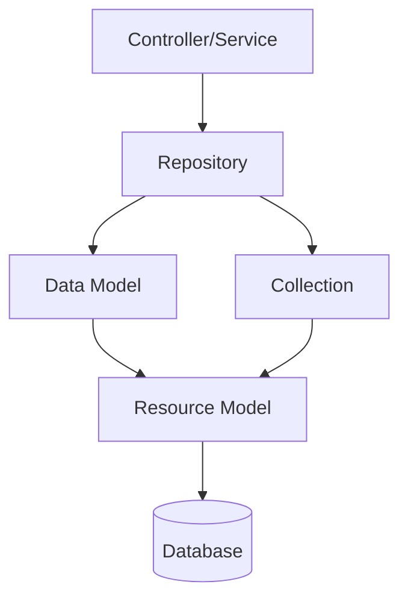

# 💾 Models and Data Layer

> Complete Guide to Models, ResourceModels, Repositories in Magento 2

---

## 📑 Table of Contents

1. [Introduction](#1-introduction)
2. [File Structure](#2-file-structure)
3. [Data Model](#3-data-model)
4. [Resource Model](#4-resource-model)
5. [Collection](#5-collection)
6. [Repository Pattern](#6-repository-pattern)
7. [Data Interface](#7-data-interface)
8. [SearchCriteria](#8-searchcriteria)
9. [CRUD Operations](#9-crud-operations)
10. [Best Practices](#10-best-practices)
11. [Advanced Topics](#11-advanced-topics)

---

## 1. Introduction

### Data Layers in Magento 2



### Layer Responsibilities

| Layer | Responsibility |
|-------|----------------|
| **Data Model** | Data representation (Entity) |
| **Resource Model** | Database operations |
| **Collection** | Collection of Models |
| **Repository** | CRUD API layer |

---

## 2. File Structure

```
app/code/Vendor/Module/
├── Api/
│   ├── Data/
│   │   └── EntityInterface.php        # Data interface
│   └── EntityRepositoryInterface.php  # Repository interface
│
├── Model/
│   ├── Entity.php                     # Data Model
│   ├── EntityRepository.php           # Repository Implementation
│   └── ResourceModel/
│       ├── Entity.php                 # Resource Model
│       └── Entity/
│           └── Collection.php         # Collection
│
└── etc/
    └── di.xml                         # Interface bindings
```

---

## 3. Data Model

### Complete Code

```php
<?php
declare(strict_types=1);

namespace Vendor\Module\Model;

use Magento\Framework\Model\AbstractModel;
use Magento\Framework\DataObject\IdentityInterface;
use Vendor\Module\Api\Data\EntityInterface;
use Vendor\Module\Model\ResourceModel\Entity as ResourceModel;

class Entity extends AbstractModel implements EntityInterface, IdentityInterface
{
    public const CACHE_TAG = 'vendor_module_entity';

    protected $_cacheTag = self::CACHE_TAG;
    protected $_eventPrefix = 'vendor_module_entity';
    protected $_eventObject = 'entity';

    protected function _construct(): void
    {
        $this->_init(ResourceModel::class);
    }

    public function getIdentities(): array
    {
        return [self::CACHE_TAG . '_' . $this->getId()];
    }

    // Getters and Setters
    public function getEntityId(): ?int
    {
        return $this->getData(self::ENTITY_ID) ? (int) $this->getData(self::ENTITY_ID) : null;
    }

    public function setEntityId(int $entityId): EntityInterface
    {
        return $this->setData(self::ENTITY_ID, $entityId);
    }

    public function getName(): ?string
    {
        return $this->getData(self::NAME);
    }

    public function setName(string $name): EntityInterface
    {
        return $this->setData(self::NAME, $name);
    }
}
```

---

## 4. Resource Model

### Complete Code

```php
<?php
declare(strict_types=1);

namespace Vendor\Module\Model\ResourceModel;

use Magento\Framework\Model\ResourceModel\Db\AbstractDb;
use Magento\Framework\Model\AbstractModel;

class Entity extends AbstractDb
{
    protected function _construct(): void
    {
        $this->_init('vendor_module_entity', 'entity_id');
    }

    protected function _beforeSave(AbstractModel $object): self
    {
        if ($object->isObjectNew()) {
            $object->setData('created_at', date('Y-m-d H:i:s'));
        }
        $object->setData('updated_at', date('Y-m-d H:i:s'));

        return parent::_beforeSave($object);
    }
}
```

---

## 5. Collection

### Complete Code

```php
<?php
declare(strict_types=1);

namespace Vendor\Module\Model\ResourceModel\Entity;

use Magento\Framework\Model\ResourceModel\Db\Collection\AbstractCollection;
use Vendor\Module\Model\Entity as Model;
use Vendor\Module\Model\ResourceModel\Entity as ResourceModel;

class Collection extends AbstractCollection
{
    protected $_idFieldName = 'entity_id';

    protected function _construct(): void
    {
        $this->_init(Model::class, ResourceModel::class);
    }

    public function addActiveFilter(): self
    {
        $this->addFieldToFilter('is_active', ['eq' => 1]);
        return $this;
    }
}
```

### Filter Conditions

```php
// Equal
$collection->addFieldToFilter('status', ['eq' => 1]);

// Not Equal
$collection->addFieldToFilter('status', ['neq' => 0]);

// LIKE
$collection->addFieldToFilter('name', ['like' => '%test%']);

// IN
$collection->addFieldToFilter('id', ['in' => [1, 2, 3]]);

// NULL
$collection->addFieldToFilter('field', ['null' => true]);

// BETWEEN
$collection->addFieldToFilter('created_at', [
    'from' => '2024-01-01',
    'to' => '2024-12-31'
]);
```

---

## 6. Repository Pattern

### Repository Interface

```php
<?php
declare(strict_types=1);

namespace Vendor\Module\Api;

use Magento\Framework\Api\SearchCriteriaInterface;
use Vendor\Module\Api\Data\EntityInterface;
use Vendor\Module\Api\Data\EntitySearchResultsInterface;

interface EntityRepositoryInterface
{
    public function save(EntityInterface $entity): EntityInterface;
    public function getById(int $entityId): EntityInterface;
    public function delete(EntityInterface $entity): bool;
    public function deleteById(int $entityId): bool;
    public function getList(SearchCriteriaInterface $searchCriteria): EntitySearchResultsInterface;
}
```

### Repository Implementation

```php
<?php
declare(strict_types=1);

namespace Vendor\Module\Model;

use Magento\Framework\Exception\CouldNotSaveException;
use Magento\Framework\Exception\NoSuchEntityException;
use Vendor\Module\Api\EntityRepositoryInterface;
use Vendor\Module\Api\Data\EntityInterface;
use Vendor\Module\Model\ResourceModel\Entity as ResourceModel;

class EntityRepository implements EntityRepositoryInterface
{
    public function __construct(
        private ResourceModel $resourceModel,
        private EntityFactory $entityFactory
    ) {}

    public function save(EntityInterface $entity): EntityInterface
    {
        try {
            $this->resourceModel->save($entity);
        } catch (\Exception $e) {
            throw new CouldNotSaveException(__('Could not save: %1', $e->getMessage()));
        }
        return $entity;
    }

    public function getById(int $entityId): EntityInterface
    {
        $entity = $this->entityFactory->create();
        $this->resourceModel->load($entity, $entityId);

        if (!$entity->getId()) {
            throw new NoSuchEntityException(__('Entity with ID "%1" does not exist.', $entityId));
        }
        return $entity;
    }
}
```

### di.xml Binding

```xml
<preference for="Vendor\Module\Api\EntityRepositoryInterface"
            type="Vendor\Module\Model\EntityRepository"/>
<preference for="Vendor\Module\Api\Data\EntityInterface"
            type="Vendor\Module\Model\Entity"/>
```

---

## 7. Data Interface

```php
<?php
declare(strict_types=1);

namespace Vendor\Module\Api\Data;

interface EntityInterface
{
    public const ENTITY_ID = 'entity_id';
    public const NAME = 'name';
    public const STATUS = 'status';

    public function getEntityId(): ?int;
    public function setEntityId(int $entityId): self;
    public function getName(): ?string;
    public function setName(string $name): self;
}
```

---

## 8. SearchCriteria

```php
use Magento\Framework\Api\SearchCriteriaBuilder;

class EntityService
{
    public function __construct(
        private EntityRepositoryInterface $repository,
        private SearchCriteriaBuilder $searchCriteriaBuilder
    ) {}

    public function getActiveEntities(): array
    {
        $this->searchCriteriaBuilder->addFilter('is_active', 1);
        $this->searchCriteriaBuilder->setPageSize(10);

        $searchCriteria = $this->searchCriteriaBuilder->create();
        $result = $this->repository->getList($searchCriteria);

        return $result->getItems();
    }
}
```

---

## 9. CRUD Operations

### Create

```php
$entity = $this->entityFactory->create();
$entity->setName('New Entity');
$savedEntity = $this->entityRepository->save($entity);
```

### Read

```php
$entity = $this->entityRepository->getById(1);
```

### Update

```php
$entity = $this->entityRepository->getById(1);
$entity->setName('Updated Name');
$this->entityRepository->save($entity);
```

### Delete

```php
$this->entityRepository->deleteById(1);
```

---

## 10. Best Practices

### ✅ Always Use Repository

```php
// ✅ Correct
$entity = $this->entityRepository->getById($id);

// ❌ Deprecated
$entity = $this->entityFactory->create()->load($id);
```

### ✅ Use Interfaces

```php
// ✅ Correct
use Vendor\Module\Api\Data\EntityInterface;

// ❌ Wrong - Concrete class
use Vendor\Module\Model\Entity;
```

### ✅ Use Factories

```php
// ✅ Correct
$entity = $this->entityFactory->create();

// ❌ Wrong
$entity = new Entity();
```

---

## 11. Advanced Topics

### Custom Collection Queries

```php
public function getEntitiesWithJoin(): Collection
{
    $collection = $this->collectionFactory->create();

    $collection->getSelect()->joinLeft(
        ['related' => $this->getTable('related_table')],
        'main_table.entity_id = related.entity_id',
        ['related_name' => 'name']
    );

    return $collection;
}
```

---

## 📌 Summary

| Component | Path | Purpose |
|-----------|------|---------|
| **Model** | `Model/Entity.php` | Data representation |
| **ResourceModel** | `Model/ResourceModel/Entity.php` | DB operations |
| **Collection** | `Model/ResourceModel/Entity/Collection.php` | Multi-record queries |
| **Repository** | `Model/EntityRepository.php` | CRUD API |
| **Interface** | `Api/Data/EntityInterface.php` | Contract |

---

## ⬅️ [Previous](./04_CONTROLLERS.md) | [🏠 Home](../MODULE_STRUCTURE_EN.md) | [Next ➡️](./06_BLOCKS.md)
