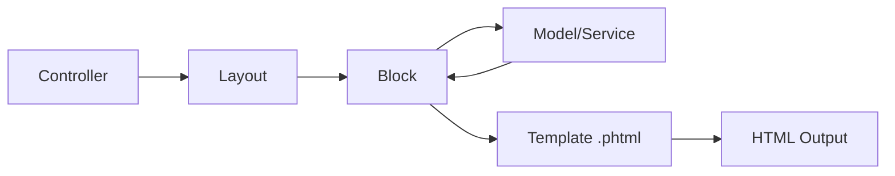

# 🧱 Blocks

> Complete Guide to Blocks in Magento 2

---

## 📑 Table of Contents

1. [Introduction](#1-introduction)
2. [File Location](#2-file-location)
3. [Block Types](#3-block-types)
4. [Template Block](#4-template-block)
5. [Connecting Block to Layout](#5-connecting-block-to-layout)
6. [Block Methods](#6-block-methods)
7. [Caching](#7-caching)
8. [ViewModels](#8-viewmodels)
9. [Best Practices](#9-best-practices)

---

## 1. Introduction

### What is a Block?

A Block is the bridge between **Business Logic** and the **Template (View)**.



---

## 2. File Location

```
app/code/Vendor/Module/
├── Block/
│   ├── SomeBlock.php
│   └── Adminhtml/
│       └── Entity/
│           └── Edit.php
└── view/
    └── frontend/
        └── templates/
            └── some_block.phtml
```

---

## 3. Block Types

| Type | Base Class | Usage |
|------|------------|-------|
| Template | `Magento\Framework\View\Element\Template` | With .phtml template |
| AbstractBlock | `Magento\Framework\View\Element\AbstractBlock` | Without template |
| Admin | `Magento\Backend\Block\Template` | Admin area |

---

## 4. Template Block

```php
<?php
declare(strict_types=1);

namespace Vendor\Module\Block;

use Magento\Framework\View\Element\Template;
use Magento\Framework\View\Element\Template\Context;
use Vendor\Module\Api\EntityRepositoryInterface;

class EntityList extends Template
{
    public function __construct(
        Context $context,
        private EntityRepositoryInterface $entityRepository,
        array $data = []
    ) {
        parent::__construct($context, $data);
    }

    public function getEntities(): array
    {
        return $this->entityRepository->getAll();
    }

    public function getEntityUrl($entity): string
    {
        return $this->getUrl('vendor_module/entity/view', ['id' => $entity->getId()]);
    }
}
```

### Template File

```php
<?php
/** @var \Vendor\Module\Block\EntityList $block */
?>
<div class="entity-list">
    <?php foreach ($block->getEntities() as $entity): ?>
        <div class="entity-item">
            <a href="<?= $block->escapeUrl($block->getEntityUrl($entity)) ?>">
                <?= $block->escapeHtml($entity->getName()) ?>
            </a>
        </div>
    <?php endforeach; ?>
</div>
```

---

## 5. Connecting Block to Layout

```xml
<?xml version="1.0"?>
<page xmlns:xsi="http://www.w3.org/2001/XMLSchema-instance"
      xsi:noNamespaceSchemaLocation="urn:magento:framework:View/Layout/etc/page_configuration.xsd">
    <body>
        <referenceContainer name="content">
            <block class="Vendor\Module\Block\EntityList"
                   name="entity.list"
                   template="Vendor_Module::entity/list.phtml">
                <arguments>
                    <argument name="view_model" xsi:type="object">Vendor\Module\ViewModel\EntityViewModel</argument>
                </arguments>
            </block>
        </referenceContainer>
    </body>
</page>
```

---

## 6. Block Methods

### Escaping Methods (XSS Protection)

```php
// HTML escape
$block->escapeHtml($string);

// URL escape
$block->escapeUrl($url);

// JavaScript escape
$block->escapeJs($string);

// HTML attribute escape
$block->escapeHtmlAttr($string);
```

### URL Methods

```php
$block->getUrl('module/controller/action', ['param' => 'value']);
$block->getBaseUrl();
$block->getViewFileUrl('Vendor_Module::js/script.js');
```

### Child Blocks

```php
$block->getChildHtml('child.name');
$block->getChildBlock('child.name');
```

---

## 7. Caching

```php
protected function getCacheKeyInfo(): array
{
    return [
        'VENDOR_MODULE_ENTITY_LIST',
        $this->_storeManager->getStore()->getId(),
        $this->getTemplate()
    ];
}

protected function getCacheLifetime(): int
{
    return 3600; // 1 hour
}
```

---

## 8. ViewModels

### ViewModel (Recommended Approach)

```php
<?php
namespace Vendor\Module\ViewModel;

use Magento\Framework\View\Element\Block\ArgumentInterface;

class EntityViewModel implements ArgumentInterface
{
    public function __construct(
        private EntityRepositoryInterface $repository
    ) {}

    public function getEntities(): array
    {
        return $this->repository->getAll();
    }
}
```

### Using in Layout

```xml
<block class="Magento\Framework\View\Element\Template" name="my.block"
       template="Vendor_Module::template.phtml">
    <arguments>
        <argument name="view_model" xsi:type="object">Vendor\Module\ViewModel\EntityViewModel</argument>
    </arguments>
</block>
```

### Using in Template

```php
<?php
$viewModel = $block->getData('view_model');
$entities = $viewModel->getEntities();
?>
```

---

## 9. Best Practices

### ✅ Use ViewModels

ViewModels are preferred over Blocks for new development.

### ✅ Always Escape Output

```php
<?= $block->escapeHtml($entity->getName()) ?>
```

### ✅ Keep Blocks Thin

Move business logic to Services or ViewModels.

---

## 📌 Summary

| Component | Path |
|-----------|------|
| **Block** | `Block/MyBlock.php` |
| **Template** | `view/frontend/templates/my_block.phtml` |
| **Layout** | `view/frontend/layout/route_controller_action.xml` |
| **ViewModel** | `ViewModel/MyViewModel.php` |

---

## ⬅️ [Previous](./05_MODELS.md) | [🏠 Home](../MODULE_STRUCTURE_EN.md) | [Next ➡️](./07_VIEWS.md)
