# 📚 Magento 2 Module Structure Guide

> Complete guide to Magento 2 module structure with links to detailed documentation

---

## 📁 Complete Module Structure

```
app/code/Vendor/ModuleName/
│
├── 📄 registration.php              # [1] Module Registration
│
├── 📂 etc/                          # [2] Configuration Files
│   ├── module.xml                   # Module Definition
│   ├── di.xml                       # Dependency Injection
│   ├── events.xml                   # Event Registration
│   ├── crontab.xml                  # Cron Jobs Schedule
│   ├── webapi.xml                   # API Endpoints
│   ├── acl.xml                      # Access Control List
│   ├── config.xml                   # Default Config Values
│   │
│   ├── 📂 adminhtml/                # Admin Configuration
│   │   ├── routes.xml
│   │   ├── system.xml               # Admin Panel Settings
│   │   ├── menu.xml                 # Admin Menus
│   │   └── di.xml
│   │
│   └── 📂 frontend/                 # Frontend Configuration
│       ├── routes.xml
│       ├── sections.xml             # Customer Sections
│       └── di.xml
│
├── 📂 Api/                          # [3] Service Contracts
│   ├── 📂 Data/                     # Data Interfaces
│   │   └── EntityInterface.php
│   └── EntityRepositoryInterface.php
│
├── 📂 Block/                        # [4] View Blocks
│   ├── 📂 Adminhtml/                # Admin Blocks
│   └── SomeBlock.php
│
├── 📂 Controller/                   # [5] Controllers
│   ├── 📂 Adminhtml/                # Admin Controllers
│   │   └── Entity/
│   │       ├── Index.php
│   │       ├── Edit.php
│   │       ├── Save.php
│   │       └── Delete.php
│   └── 📂 Index/                    # Frontend Controllers
│       └── Index.php
│
├── 📂 Model/                        # [6] Models
│   ├── Entity.php                   # Data Model
│   ├── EntityRepository.php         # Repository
│   ├── 📂 ResourceModel/            # Database Layer
│   │   ├── Entity.php               # Resource Model
│   │   └── Entity/
│   │       └── Collection.php       # Collection
│   └── 📂 Config/
│       └── Source/                  # Dropdowns
│
├── 📂 Observer/                     # [7] Event Observers
│   └── SomeObserver.php
│
├── 📂 Plugin/                       # [8] Plugins (Interceptors)
│   └── SomePlugin.php
│
├── 📂 Helper/                       # [9] Helper Classes
│   └── Data.php
│
├── 📂 Setup/                        # [10] Installation
│   └── 📂 Patch/
│       ├── 📂 Data/                 # Data Patches
│       │   └── AddSampleData.php
│       └── 📂 Schema/               # Schema Patches
│           └── CreateTable.php
│
├── 📂 Cron/                         # [11] Cron Jobs
│   └── SomeJob.php
│
├── 📂 Console/                      # [12] CLI Commands
│   └── Command/
│       └── SomeCommand.php
│
├── 📂 view/                         # [13] View Layer
│   ├── 📂 adminhtml/
│   │   ├── 📂 layout/               # Admin Layouts
│   │   ├── 📂 templates/            # Admin Templates
│   │   ├── 📂 ui_component/         # UI Components
│   │   └── 📂 web/
│   │       ├── css/
│   │       └── js/
│   │
│   ├── 📂 frontend/
│   │   ├── 📂 layout/               # Frontend Layouts
│   │   ├── 📂 templates/            # PHTML Files
│   │   ├── 📂 requirejs-config.js   # RequireJS Config
│   │   └── 📂 web/
│   │       ├── css/
│   │       ├── js/
│   │       └── images/
│   │
│   └── 📂 base/                     # Shared (Admin + Frontend)
│       └── 📂 web/
│
├── 📂 i18n/                         # [14] Translations
│   ├── en_US.csv
│   └── ar_SA.csv
│
├── 📂 Test/                         # Tests
│   ├── 📂 Unit/
│   └── 📂 Integration/
│
└── 📄 composer.json                 # Composer Package Info (optional)
```

---

## 🔄 Basic Flow

```mermaid
flowchart TD
    subgraph Bootstrap["🚀 Bootstrap"]
        A[HTTP Request] --> B[registration.php]
        B --> C[module.xml]
    end

    subgraph Routing["🛣️ Routing"]
        C --> D[routes.xml]
        D --> E[Controller/Action]
    end

    subgraph Business["💼 Business Logic"]
        E --> F[Model]
        F --> G[ResourceModel]
        G --> H[(Database)]
    end

    subgraph Presentation["🎨 Presentation"]
        E --> I[Block]
        I --> J[Layout XML]
        J --> K[Template PHTML]
    end

    K --> L[HTTP Response]

    style Bootstrap fill:#e1f5fe
    style Routing fill:#fff3e0
    style Business fill:#f3e5f5
    style Presentation fill:#e8f5e9
```



---

## 📖 Detailed Documentation

> Each module component has its own detailed documentation file

| # | Component | File | Status |
|---|-----------|------|--------|
| 1 | Registration | [docs/en/01_REGISTRATION.md](./docs/en/01_REGISTRATION.md) | ✅ |
| 2 | Module XML | [docs/en/02_MODULE_XML.md](./docs/en/02_MODULE_XML.md) | ✅ |
| 3 | Routes | [docs/en/03_ROUTES.md](./docs/en/03_ROUTES.md) | ✅ |
| 4 | Controllers | [docs/en/04_CONTROLLERS.md](./docs/en/04_CONTROLLERS.md) | ✅ |
| 5 | Models | [docs/en/05_MODELS.md](./docs/en/05_MODELS.md) | ✅ |
| 6 | Blocks | [docs/en/06_BLOCKS.md](./docs/en/06_BLOCKS.md) | ✅ |
| 7 | Views & Layouts | [docs/en/07_VIEWS.md](./docs/en/07_VIEWS.md) | ✅ |
| 8 | Dependency Injection | [docs/en/08_DI.md](./docs/en/08_DI.md) | ✅ |
| 9 | Observers | [docs/en/09_OBSERVERS.md](./docs/en/09_OBSERVERS.md) | ✅ |
| 10 | Plugins | [docs/en/10_PLUGINS.md](./docs/en/10_PLUGINS.md) | ✅ |
| 11 | API & WebAPI | [docs/en/11_API.md](./docs/en/11_API.md) | ✅ |
| 12 | Setup & Patches | [docs/en/12_SETUP.md](./docs/en/12_SETUP.md) | ✅ |
| 13 | CLI Commands | [docs/en/13_CLI.md](./docs/en/13_CLI.md) | ✅ |
| 14 | Cron Jobs | [docs/en/14_CRON.md](./docs/en/14_CRON.md) | ✅ |

### 🔥 Advanced Topics

| # | Component | File | Status |
|---|-----------|------|--------|
| 15 | EAV System | [docs/en/15_EAV.md](./docs/en/15_EAV.md) | ✅ |
| 16 | XML Configuration | [docs/en/16_XML_CONFIGURATION.md](./docs/en/16_XML_CONFIGURATION.md) | ✅ |
| 17 | UI Components | [docs/en/17_UI_COMPONENTS.md](./docs/en/17_UI_COMPONENTS.md) | ✅ |
| 18 | Indexers | [docs/en/18_INDEXERS.md](./docs/en/18_INDEXERS.md) | ✅ |
| 19 | Caching | [docs/en/19_CACHING.md](./docs/en/19_CACHING.md) | ✅ |
| 20 | ACL & Security | [docs/en/20_ACL_SECURITY.md](./docs/en/20_ACL_SECURITY.md) | ✅ |
| 21 | Testing | [docs/en/21_TESTING.md](./docs/en/21_TESTING.md) | ✅ |
| 22 | GraphQL | [docs/en/22_GRAPHQL.md](./docs/en/22_GRAPHQL.md) | ✅ |
| 23 | Message Queues | [docs/en/23_MESSAGE_QUEUES.md](./docs/en/23_MESSAGE_QUEUES.md) | ✅ |
| 24 | Payment Methods | [docs/en/24_PAYMENT.md](./docs/en/24_PAYMENT.md) | ✅ |
| 25 | Checkout | [docs/en/25_CHECKOUT.md](./docs/en/25_CHECKOUT.md) | ✅ |
| 26 | Themes | [docs/en/26_THEMES.md](./docs/en/26_THEMES.md) | ✅ |

---

## 🎓 Certification Roadmap

> **Want to get Adobe Commerce Developer Certification?**

📚 [**6-Month Certification Plan**](./certification-roadmap/README.md)

> **📚 Arabic Version:** [MODULE_STRUCTURE.md](./MODULE_STRUCTURE.md)

> **Legend:** ✅ Complete | 📝 In Progress | ⏳ Not Started

---

## 🔴 Minimum Required Files

To create a working module, you only need:

```
Vendor/ModuleName/
├── registration.php    # Required ❗
└── etc/
    └── module.xml      # Required ❗
```

### 1️⃣ registration.php
```php
<?php
use Magento\Framework\Component\ComponentRegistrar;

ComponentRegistrar::register(
    ComponentRegistrar::MODULE,
    'Vendor_ModuleName',
    __DIR__
);
```

### 2️⃣ etc/module.xml
```xml
<?xml version="1.0"?>
<config xmlns:xsi="http://www.w3.org/2001/XMLSchema-instance"
        xsi:noNamespaceSchemaLocation="urn:magento:framework:Module/etc/module.xsd">
    <module name="Vendor_ModuleName" setup_version="1.0.0">
        <sequence>
            <!-- Dependencies here -->
        </sequence>
    </module>
</config>
```

---

## 🚀 Important Commands

```bash
# Enable module
bin/magento module:enable Vendor_ModuleName

# Update
bin/magento setup:upgrade

# Compile DI
bin/magento setup:di:compile

# Clear cache
bin/magento cache:flush

# Check module status
bin/magento module:status Vendor_ModuleName
```

---

## 📌 Quick Reference

| Element | Path | Purpose |
|---------|------|---------|
| Registration | `registration.php` | Register module in Magento |
| Definition | `etc/module.xml` | Module name + dependencies |
| Routes | `etc/*/routes.xml` | Link URLs to Controllers |
| DI | `etc/di.xml` | Dependency Injection |
| Events | `etc/events.xml` | Register Observers |
| Cron | `etc/crontab.xml` | Schedule Tasks |
| ACL | `etc/acl.xml` | Access Permissions |
| API | `etc/webapi.xml` | REST/GraphQL Endpoints |

---

## 🔗 Useful Links

- [Magento DevDocs - Module Development](https://developer.adobe.com/commerce/php/development/)
- [Magento Coding Standards](https://developer.adobe.com/commerce/php/coding-standards/)
- [Magento Architecture](https://developer.adobe.com/commerce/php/architecture/)

---

> [!TIP]
> **Start with the basics!** Understand `registration.php` and `module.xml` first, then move on to Controllers and Models.


# Magento 2 Backend Developer - Advanced Level Study Plan
## Path to Adobe Certified Professional Developer


---

## Phase 1: Foundation (Weeks 1-4)

### Week 1: Environment Setup & Architecture
**Repository**: `Magento-Testing-Env`, `Master-Magento-development` (Sections 1-3)

- [ ] Set up Magento 2 development environment using Docker
  - Install Docker and docker-compose
  - Clone: `Magento-Testing-Env` for Redis, Elasticsearch, MariaDB setup
  - Configure local development environment
  - Learn Composer dependency management

- [ ] Understand Magento 2 Architecture
  - MVC pattern in Magento 2
  - Directory structure and file organization
  - Areas: frontend, adminhtml, webapi_rest, webapi_soap, crontab
  - Application layers: Presentation, Service, Domain, Persistence

- [ ] Module Development Basics
  - Create your first "Hello World" module
  - Understanding module.xml, registration.php
  - Module dependencies and sequence
  - Enable/disable modules via CLI

**Practical Project**: Create a basic module that displays "Hello Magento" on frontend

---

### Week 2: Core Concepts
**Repository**: `30-Days-Of-Magento2` (Week 1), `Master-Magento-development` (Sections 4-6)

- [ ] Dependency Injection
  - Object Manager (why not to use it directly)
  - Constructor injection via di.xml
  - Preference and type configuration
  - Virtual types and factories
  - Proxies for lazy loading

- [ ] Routing System
  - Frontend and admin routing
  - Custom routes and URL rewrites
  - Route configuration in routes.xml
  - Controllers and actions

- [ ] Database & Schema
  - Declarative schema (db_schema.xml)
  - Install/upgrade scripts (legacy)
  - Creating tables and modifying schema
  - Database patches (data and schema)

**Practical Project**: Build a module with custom database table and CRUD operations

---

### Week 3: Data Management
**Repository**: `30-Days-Of-Magento2` (Week 1-2), `Master-Magento-development` (Section 8)

- [ ] Models, Resource Models & Collections
  - Model layer structure
  - Resource models for database operations
  - Collections for data retrieval
  - Filtering, sorting, pagination

- [ ] Repository Pattern & Service Contracts
  - Data interfaces and repositories
  - SearchCriteria and FilterGroups
  - API contracts vs implementation
  - Extension attributes

- [ ] Data Persistence
  - Save, load, delete operations
  - Data mappers and hydrators
  - Transaction handling

**Practical Project**: Create a blog module with posts management (CRUD via repository pattern)

---

### Week 4: Plugins & Events
**Repository**: `30-Days-Of-Magento2` (Week 2), `Master-Magento-development` (Section 5-6)

- [ ] Plugin System (Interceptors)
  - Before, After, Around plugins
  - Plugin limitations and best practices
  - Sort order and plugin chains
  - When to use plugins vs observers

- [ ] Event-Driven Architecture
  - Event dispatchers and observers
  - Creating custom events
  - Observer configuration in events.xml
  - Event naming conventions
  - Reference: `Magento-Training` (Observers module)

- [ ] Preference vs Plugin vs Observer
  - Understanding when to use each
  - Performance implications
  - Upgrade compatibility

**Practical Project**: Add email notification on customer registration using observer

---

## Phase 2: Frontend & UI Development (Weeks 5-8)

### Week 5: Layout & Templating
**Repository**: `30-Days-Of-Magento2` (Week 2), `Master-Magento-development` (Section 7)

- [ ] Layout XML System
  - Layout handles and structure
  - Containers vs Blocks
  - Layout update XML files
  - Moving, removing, updating blocks

- [ ] Blocks & Templates
  - Block types (Template, Text, ListText)
  - PHTML templates and rendering
  - Block methods and data passing
  - Template hints for debugging

- [ ] UI Components
  - Listing grids
  - Forms
  - XML configuration for UI components
  - DataProviders

**Practical Project**: Create admin grid and form for your blog module

---

### Week 6: ViewModel & Frontend Patterns
**Repository**: `30-Days-Of-Magento2` (Week 2)

- [ ] ViewModel Pattern
  - Separating business logic from templates
  - Creating ViewModels
  - Injecting dependencies
  - Best practices

- [ ] JavaScript & RequireJS
  - RequireJS configuration
  - Custom JavaScript components
  - Mixins and extensions
  - KnockoutJS basics

- [ ] jQuery Widgets
  - Creating custom widgets
  - Widget options and callbacks

**Practical Project**: Add frontend JavaScript functionality to blog module (AJAX search)

---

### Week 7: Admin Development
**Repository**: `30-Days-Of-Magento2` (Week 3), `Master-Magento-development` (Section 9)

- [ ] Admin Grids & Forms
  - UI component grids
  - Form XML structure
  - Fieldsets and fields
  - Data providers and data sources

- [ ] System Configuration
  - system.xml configuration
  - Configuration scopes (global, website, store)
  - Encrypted configuration fields
  - ACL for configuration access

- [ ] ACL (Access Control List)
  - Resource hierarchy
  - Admin roles and permissions
  - ACL in acl.xml

**Practical Project**: Add system configuration and ACL to blog module

---

### Week 8: Theme Development
**Repository**: `30-Days-Of-Magento2` (Week 4), `Master-Magento-development` (Section 10)

- [ ] Custom Theme Creation
  - Theme structure and registration
  - Theme inheritance
  - Static file fallback
  - Logo, favicon, and assets

- [ ] LESS & CSS
  - LESS compilation
  - Theme variables
  - Custom styles
  - Responsive design

- [ ] Static Content Deployment
  - Development vs production mode
  - Static content generation
  - Asset optimization

**Practical Project**: Create a custom theme with branded styling

---

## Phase 3: Advanced Backend Development (Weeks 9-12)

### Week 9: API Development
**Repository**: `30-Days-Of-Magento2` (Week 4), `Master-Magento-development` (Section 11), `magento-wishlist-restapi`

- [ ] REST API
  - API routing (webapi.xml)
  - Resource authorization
  - Token-based authentication
  - Custom endpoints
  - Reference: `magento-wishlist-restapi`

- [ ] SOAP API
  - SOAP vs REST differences
  - WSDL generation
  - SOAP endpoint configuration

- [ ] API Testing
  - Postman/Insomnia setup
  - Testing GET, POST, PUT, DELETE
  - Bearer token authentication

**Practical Project**: Create REST API for blog module with authentication

---

### Week 10: GraphQL
**Repository**: `30-Days-Of-Magento2` (Week 4), `magento-graphql-workshop`, `m2-graphql-workshop`

- [ ] GraphQL Fundamentals
  - Schema definition (schema.graphqls)
  - Queries and mutations
  - Resolvers
  - Type system

- [ ] GraphQL Implementation
  - Creating custom queries
  - Creating mutations
  - Data loading and optimization
  - Filtering and pagination
  - Reference both GraphQL workshop repos

- [ ] GraphQL Testing
  - GraphQL Playground
  - Query optimization
  - N+1 query problem

**Practical Project**: Add GraphQL API to blog module

---

### Week 11: EAV & Product System
**Repository**: `30-Days-Of-Magento2` (Week 3)

- [ ] EAV (Entity-Attribute-Value)
  - EAV architecture and tables
  - Attribute management
  - Attribute sets and groups
  - Frontend and backend models

- [ ] Product Types
  - Simple, configurable, bundle, grouped
  - Virtual and downloadable products
  - Custom product types
  - Reference: `Gift-Card` module

- [ ] Catalog System
  - Categories and category attributes
  - Product attributes and attribute sets
  - Price calculation
  - Inventory management

**Practical Project**: Create custom product attribute with custom logic

---

### Week 12: Advanced Topics
**Repository**: `30-Days-Of-Magento2` (Week 3-4)

- [ ] Cron Jobs
  - Crontab.xml configuration
  - Cron groups
  - Scheduling and execution
  - Debugging cron

- [ ] Logging & Debugging
  - Custom loggers and handlers
  - Monolog integration
  - Exception handling
  - Reference: `Magento-Training` (Logger module)

- [ ] File Upload & Media
  - Image upload in admin forms
  - Media gallery integration
  - Image processing

**Practical Project**: Add image upload to blog posts with cron cleanup

---

## Phase 4: Enterprise Features (Weeks 13-16)

### Week 13: Message Queue & RabbitMQ
**Repository**: `30-Days-Of-Magento2` (Week 4)

- [ ] Message Queue Basics
  - Asynchronous operations
  - Queue configuration (queue.xml)
  - Communication.xml
  - Queue topology

- [ ] RabbitMQ Integration
  - Installing and configuring RabbitMQ
  - Publishers and consumers
  - Message handlers
  - Queue monitoring

- [ ] Bulk Operations
  - Async bulk API
  - Processing large datasets
  - Progress tracking

**Practical Project**: Implement async email sending for blog notifications

---

### Week 14: Caching & Performance
**Repository**: `30-Days-Of-Magento2` (Week 4), `Redis-Workshop`

- [ ] Cache Types
  - Full page cache (FPC)
  - Block HTML cache
  - Configuration cache
  - Layout cache
  - Cache invalidation

- [ ] Redis Integration
  - Redis for cache backend
  - Redis for session storage
  - Redis for page cache
  - Reference: `Redis-Workshop`

- [ ] Indexing
  - Index types and modes
  - Custom indexers
  - Mview (materialized views)
  - Reindexing strategies

**Practical Project**: Implement custom caching for blog module

---

### Week 15: Payment & Checkout
**Repository**: `30-Days-Of-Magento2` (Week 4)

- [ ] Payment Gateway Integration
  - Payment method structure
  - Gateway commands
  - Payment facades
  - Authorize, capture, refund

- [ ] Checkout Customization
  - Checkout steps
  - Shipping methods
  - Custom checkout fields
  - Order placement process

- [ ] Quote & Order Management
  - Quote to order conversion
  - Order states and statuses
  - Custom order attributes

**Practical Project**: Create a custom payment method (dummy gateway)

---

### Week 16: Testing & DevOps
**Repository**: `30-Days-Of-Magento2` (Week 4), `php-workshop`

- [ ] Unit Testing
  - PHPUnit setup
  - Mocking and test doubles
  - Testing best practices
  - Reference: `php-workshop` for PHPUnit

- [ ] Integration Testing
  - Magento integration test framework
  - Fixtures and data providers
  - Database testing

- [ ] Deployment
  - Composer workflows
  - Build and deployment pipeline
  - Static content versioning
  - Production mode optimization

**Practical Project**: Write unit and integration tests for blog module

---

## Phase 5: Certification Preparation (Weeks 17-20)

### Week 17-18: Certification Topics Deep Dive
**Repository**: `Magento-Training`

Study the official Adobe Certified Professional Developer exam topics:

1. **Magento Architecture & Customization** (18%)
   - Module creation and structure
   - Configuration files
   - Dependency injection
   - Plugins and events

2. **Request Flow Processing** (12%)
   - Application initialization
   - Routing and controllers
   - Action controllers

3. **Customizing UI** (10%)
   - Layout XML
   - Blocks and templates
   - UI components

4. **Working with Databases** (18%)
   - Models and collections
   - Declarative schema
   - Repository pattern

5. **EAV/Catalog** (12%)
   - EAV structure
   - Product types
   - Category management

6. **Admin Development** (10%)
   - System configuration
   - ACL
   - Admin grids and forms

7. **Customizing Business Logic** (20%)
   - Plugins, observers, preferences
   - Service contracts
   - Payment and shipping methods

---

### Week 19: Practice Exams & Review

- [ ] Take practice exams
  - SwiftOtter Study Guide
  - MageGym practice tests
  - Community practice questions

- [ ] Review weak areas
  - Revisit challenging topics
  - Hands-on practice
  - Code review of DevBigBoy modules

- [ ] Study official resources
  - Adobe Commerce Developer Guide
  - Magento DevDocs
  - Magento Stack Exchange

---

### Week 20: Final Preparation

- [ ] Last-minute review
  - Quick reference guides
  - Architecture diagrams
  - Common patterns review

- [ ] Mock exam simulation
  - Time yourself (60 questions in 90 minutes)
  - Review incorrect answers
  - Understand reasoning

- [ ] Schedule certification exam
  - Register at Adobe Certification portal
  - Choose exam date
  - Prepare exam environment

---

## Supplementary Learning Resources

### Design Patterns
**Repository**: `design-patterns-workshop`, `php-design-patterns`

Study these patterns commonly used in Magento:
- Factory Pattern
- Repository Pattern
- Proxy Pattern
- Strategy Pattern
- Singleton Pattern
- Observer Pattern
- Decorator Pattern
- Object Pool Pattern

### PHP Best Practices
**Repository**: `php-workshop`

- PHP 8.x features
- OOP principles
- SOLID principles
- PSR standards
- Error handling
- Type hinting

### Additional Projects for Practice

Reference DevBigBoy's complete modules:
1. `Gift-Card` - Complex module with custom product type
2. `Jobs` - Module structure and patterns
3. `Popup_Magento2` - Frontend and admin integration
4. `magento-category-content-management` - Category customization

---

## Success Metrics & Milestones

### After Phase 1 (Week 4)
- Can create basic modules independently
- Understand Magento architecture
- Comfortable with database operations

### After Phase 2 (Week 8)
- Can develop admin interfaces
- Create custom themes
- Build UI components

### After Phase 3 (Week 12)
- Develop REST and GraphQL APIs
- Understand EAV system
- Implement advanced features

### After Phase 4 (Week 16)
- Enterprise-level development skills
- Performance optimization knowledge
- Production deployment experience

### After Phase 5 (Week 20)
- Ready for certification exam
- Advanced Magento developer
- Can architect complex solutions

---

## Daily Study Routine

**Weekdays (2-3 hours/day)**
- 1 hour: Reading documentation and theory
- 1 hour: Hands-on coding practice
- 30 min: Code review of DevBigBoy repositories

**Weekends (4-5 hours/day)**
- 2 hours: Working on weekly project
- 1 hour: Exploring additional modules
- 1 hour: Practice problems and challenges
- 1 hour: Community engagement (Stack Exchange, forums)

---

## Key Resources

### GitHub Repositories (DevBigBoy)
- Main: https://github.com/DevBigBoy/30-Days-Of-Magento2
- Certification: https://github.com/DevBigBoy/Magento-Training
- Master Guide: https://github.com/DevBigBoy/Master-Magento-development
- GraphQL: https://github.com/DevBigBoy/m2-graphql-workshop
- Environment: https://github.com/DevBigBoy/Magento-Testing-Env

### Official Documentation
- Adobe Commerce Developer Guide: https://developer.adobe.com/commerce/
- Magento DevDocs: https://devdocs.magento.com/
- Magento PHP Developer Guide
- Magento Frontend Developer Guide

### Community
- Magento Stack Exchange
- Magento Community Forums
- Magento GitHub Discussions

---

## Certification Details

**Adobe Certified Professional - Adobe Commerce Developer**

- **Exam Code**: AD0-E717
- **Duration**: 90 minutes
- **Questions**: 60 multiple choice
- **Passing Score**: 68% (41/60)
- **Cost**: $225 USD
- **Validity**: 2 years
- **Format**: Online proctored or test center

---

## Tips for Success

1. **Hands-on Practice**: Code daily, don't just read
2. **Clone and Study**: Use DevBigBoy's repos as reference
3. **Build Projects**: Each phase project reinforces learning
4. **Community Engagement**: Ask questions, help others
5. **Official Docs**: Always cross-reference with Adobe documentation
6. **Git Workflow**: Track your progress with version control
7. **Code Review**: Study well-written Magento modules
8. **Stay Updated**: Follow Magento release notes and updates
9. **Performance Focus**: Always consider scalability
10. **Security First**: Implement secure coding practices

---

**Good luck on your journey to becoming an Adobe Certified Professional - Magento Backend Developer!**
