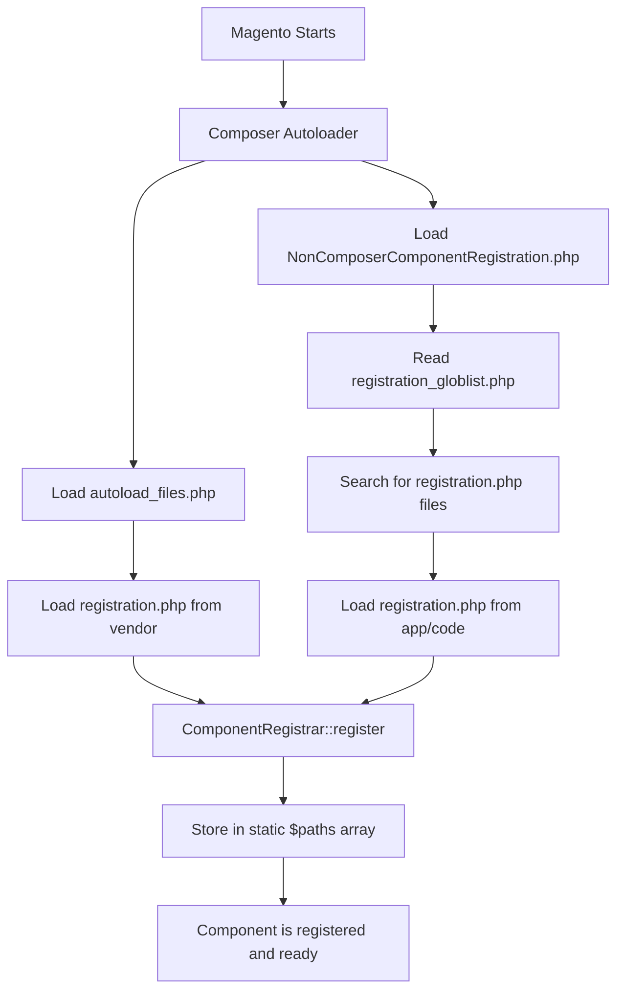
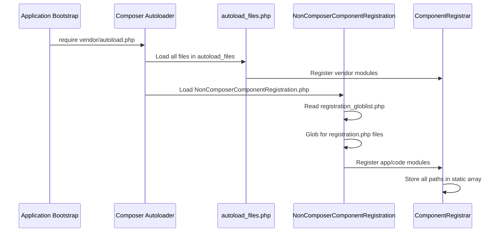

# 📚 Complete Guide to `registration.php` in Magento 2

## 📄 Current File Contents

```php
<?php
use Magento\Framework\Component\ComponentRegistrar;

ComponentRegistrar::register(ComponentRegistrar::MODULE, 'Elshrif_HelloWorld', __DIR__);
```

---

## 🎯 Table of Contents

1. [What is `registration.php`?](#1-what-is-registrationphp)
2. [Where Does This File Come From?](#2-where-does-this-file-come-from)
3. [Why Do We Need It?](#3-why-do-we-need-it)
4. [How Is It Loaded?](#4-how-is-it-loaded)
5. [Understanding the ComponentRegistrar Class](#5-understanding-the-componentregistrar-class)
6. [Component Types](#6-component-types)
7. [Step-by-Step Registration Mechanism](#7-step-by-step-registration-mechanism)
8. [Related CLI Commands](#8-related-cli-commands)
9. [Vendor Files and Directories](#9-vendor-files-and-directories)
10. [Why Can't Multiple Components Share the Same Name?](#10-why-cant-multiple-components-share-the-same-name)
11. [Best Practices ✅](#11-best-practices-)
12. [Bad Practices ❌](#12-bad-practices-)
13. [Advanced: Internal System Mechanics](#13-advanced-internal-system-mechanics)

---

## 1. What is `registration.php`?

`registration.php` is the **first entry point** for any component in Magento 2. This file is responsible for:

- **Registering the component** in Magento's Component Registry
- **Defining the component type** (Module, Theme, Language, Library, Setup)
- **Specifying the component's path** on the filesystem

> [!IMPORTANT]
> Without this file, **Magento will not recognize your component's existence** even if all other files are present.

---

## 2. Where Does This File Come From?

### Source Location in Vendor

The `ComponentRegistrar` class is located at:

```
vendor/magento/framework/Component/ComponentRegistrar.php
```

### Class Structure

```php
namespace Magento\Framework\Component;

class ComponentRegistrar implements ComponentRegistrarInterface
{
    const MODULE = 'module';
    const LIBRARY = 'library';
    const THEME = 'theme';
    const LANGUAGE = 'language';
    const SETUP = 'setup';

    private static $paths = [
        self::MODULE => [],
        self::LIBRARY => [],
        self::LANGUAGE => [],
        self::THEME => [],
        self::SETUP => []
    ];

    public static function register($type, $componentName, $path)
    {
        // Registration happens here
    }
}
```

---

## 3. Why Do We Need It?

### 🔹 3.1 Component Discovery
Magento uses this file to automatically discover all installed components.

### 🔹 3.2 Autoloading
Ensures Magento can load the component's classes.

### 🔹 3.3 CLI Integration
Commands like `bin/magento module:status` depend on this registration.

### 🔹 3.4 Load Order
Helps determine the component loading sequence.

---

## 4. How Is It Loaded?

### 🛣️ Loading Paths

There are **two methods** for loading `registration.php`:

### Method 1: Via Composer (for vendor components)

```
vendor/composer/autoload_files.php
```

Contains a list of all `registration.php` files:

```php
return array(
    '07ec02c7e667fdcb3e30c02cc772b743' => $vendorDir . '/magento/framework/registration.php',
    '07f4b29581a907da6d366307f545041b' => $vendorDir . '/magento/module-user/registration.php',
    // ... hundreds of files
);
```

### Method 2: Via Glob Patterns (for app/code components)

#### Responsible File:
```
app/etc/NonComposerComponentRegistration.php
```

#### How It Works:

```php
(static function (): void {
    $globPatterns = require __DIR__ . '/registration_globlist.php';
    $baseDir = \dirname(__DIR__, 2) . '/';

    foreach ($globPatterns as $globPattern) {
        $files = \glob($baseDir . $globPattern, GLOB_NOSORT);
        \array_map(
            static function (string $file): void {
                require_once $file;
            },
            $files
        );
    }
})();
```

#### Glob Patterns List:

```php
// app/etc/registration_globlist.php
return [
    'app/code/*/*/cli_commands.php',
    'app/code/*/*/registration.php',        // <- Your module is loaded here
    'app/design/*/*/*/registration.php',
    'app/i18n/*/*/registration.php',
    'lib/internal/*/*/registration.php',
    'lib/internal/*/*/*/registration.php',
    'setup/src/*/*/registration.php'
];
```

---

## 5. Understanding the ComponentRegistrar Class

### Location in Vendor

```
vendor/magento/framework/Component/ComponentRegistrar.php
```

### Core Methods

| Method | Purpose |
|--------|---------|
| `register($type, $name, $path)` | Register a new component |
| `getPaths($type)` | Get all paths of a specific type |
| `getPath($type, $name)` | Get path of a specific component |
| `validateType($type)` | Validate component type |

### The `register` Method Explained

```php
public static function register($type, $componentName, $path)
{
    // 1. Validate the type
    self::validateType($type);

    // 2. Check if component already exists
    if (isset(self::$paths[$type][$componentName])) {
        throw new \LogicException(
            ucfirst($type) . ' \'' . $componentName . '\' from \'' . $path . '\' '
            . 'has been already defined in \'' . self::$paths[$type][$componentName] . '\'.'
        );
    }

    // 3. Register the component
    self::$paths[$type][$componentName] = str_replace('\\', '/', $path);
}
```

---

## 6. Component Types

### Types Table

| Type | Constant | Description | Example Path |
|------|----------|-------------|--------------|
| Module | `ComponentRegistrar::MODULE` | Extensions/Modules | `app/code/Vendor/Module` |
| Theme | `ComponentRegistrar::THEME` | Themes/Templates | `app/design/frontend/Vendor/theme` |
| Language | `ComponentRegistrar::LANGUAGE` | Translation Packs | `app/i18n/vendor/language` |
| Library | `ComponentRegistrar::LIBRARY` | Libraries | `lib/internal/Vendor/Library` |
| Setup | `ComponentRegistrar::SETUP` | Setup Tools | `setup/src/Vendor/Setup` |

### Examples for Each Type

#### Module
```php
ComponentRegistrar::register(ComponentRegistrar::MODULE, 'Vendor_ModuleName', __DIR__);
```

#### Theme
```php
ComponentRegistrar::register(ComponentRegistrar::THEME, 'frontend/Vendor/theme-name', __DIR__);
```

#### Language
```php
ComponentRegistrar::register(ComponentRegistrar::LANGUAGE, 'vendor_language-code', __DIR__);
```

---

## 7. Step-by-Step Registration Mechanism

### 🔄 Complete Lifecycle



### Detailed Registration Steps

#### Step 1: Bootstrap
When any request runs in Magento:
```php
require __DIR__ . '/app/bootstrap.php';
```

#### Step 2: Composer Autoload
```php
require_once __DIR__ . '/vendor/autoload.php';
```

#### Step 3: Load Registration Files
Composer automatically loads all files in `autoload_files.php`.

#### Step 4: Register Components
Each `registration.php` file executes `ComponentRegistrar::register()`.

#### Step 5: Memory Storage
Paths are stored in the `static $paths` array.

---

## 8. Related CLI Commands

### 📋 Commands Affected by registration.php

| Command | Purpose | How It Uses registration.php |
|---------|---------|------------------------------|
| `bin/magento module:status` | Show module status | Reads registered components |
| `bin/magento module:enable` | Enable a module | Requires valid registration |
| `bin/magento module:disable` | Disable a module | Requires valid registration |
| `bin/magento setup:upgrade` | Update schema | Loads all registered modules |
| `bin/magento setup:di:compile` | Generate DI | Needs module paths |
| `bin/magento cache:flush` | Clear cache | Reloads registrations |

### Useful Diagnostic Commands

```bash
# Show all modules
bin/magento module:status

# Show only enabled modules
bin/magento module:status --enabled

# Show only disabled modules
bin/magento module:status --disabled

# Enable a module
bin/magento module:enable Elshrif_HelloWorld

# Update after enabling
bin/magento setup:upgrade
```

---

## 9. Vendor Files and Directories

### 🗂️ Key Files

```
vendor/
├── magento/
│   └── framework/
│       └── Component/
│           ├── ComponentRegistrar.php      # Main class
│           └── ComponentRegistrarInterface.php  # Interface
├── composer/
│   ├── autoload_files.php     # Files to load list
│   ├── autoload_static.php    # Same list, static version
│   ├── autoload_psr4.php      # PSR-4 mappings
│   └── ClassLoader.php        # Class loader
```

### The Interface

```php
// vendor/magento/framework/Component/ComponentRegistrarInterface.php
interface ComponentRegistrarInterface
{
    public function getPaths($type);
    public function getPath($type, $componentName);
}
```

---

## 10. Why Can't Multiple Components Share the Same Name?

### ⚠️ Technical Reason

In the `register` method:

```php
public static function register($type, $componentName, $path)
{
    self::validateType($type);

    // Here's the check! 👇
    if (isset(self::$paths[$type][$componentName])) {
        throw new \LogicException(
            ucfirst($type) . ' \'' . $componentName . '\' from \'' . $path . '\' '
            . 'has been already defined in \'' . self::$paths[$type][$componentName] . '\'.'
        );
    }

    self::$paths[$type][$componentName] = str_replace('\\', '/', $path);
}
```

### 🎯 Logical Reasons

#### 1. Conflict Prevention
```
❌ Error: Two components with same name
   app/code/Vendor/Module/registration.php
   vendor/other/Module/registration.php

   Both register: 'Vendor_Module'
```

#### 2. Unique Path Resolution
Magento uses the name to find the path:
```php
$path = ComponentRegistrar::getPath(ComponentRegistrar::MODULE, 'Vendor_Module');
// Must return only ONE path!
```

#### 3. Preventing Unintended Overrides
If we allowed multiple registrations:
- Which files would be loaded?
- Which config would be used?
- Which classes would be available?

### Error Message

```
Module 'Vendor_Module' from '/path/to/new/module'
has been already defined in '/path/to/existing/module'.
```

---

## 11. Best Practices ✅

### ✅ 1. Module Name Matches Directory Path

```php
// Path: app/code/Elshrif/HelloWorld/registration.php
// Name: Elshrif_HelloWorld ✅

ComponentRegistrar::register(ComponentRegistrar::MODULE, 'Elshrif_HelloWorld', __DIR__);
```

### ✅ 2. Always Use `__DIR__`

```php
// ✅ Correct - Dynamic path
ComponentRegistrar::register(ComponentRegistrar::MODULE, 'Vendor_Module', __DIR__);

// ❌ Wrong - Hardcoded path
ComponentRegistrar::register(ComponentRegistrar::MODULE, 'Vendor_Module', '/var/www/html/app/code/Vendor/Module');
```

### ✅ 3. Add Strict Types Declaration

```php
<?php
declare(strict_types=1);

use Magento\Framework\Component\ComponentRegistrar;

ComponentRegistrar::register(ComponentRegistrar::MODULE, 'Vendor_Module', __DIR__);
```

### ✅ 4. Keep It Simple

```php
// ✅ Simple and direct
<?php
use Magento\Framework\Component\ComponentRegistrar;

ComponentRegistrar::register(ComponentRegistrar::MODULE, 'Vendor_Module', __DIR__);
```

### ✅ 5. Add Copyright Header

```php
<?php
/**
 * Copyright © Your Company. All rights reserved.
 * See LICENSE.txt for license details.
 */
declare(strict_types=1);

use Magento\Framework\Component\ComponentRegistrar;

ComponentRegistrar::register(ComponentRegistrar::MODULE, 'Vendor_Module', __DIR__);
```

### ✅ 6. Follow PSR-4 Naming

| Path | Module Name |
|------|-------------|
| `Elshrif/HelloWorld` | `Elshrif_HelloWorld` |
| `Company/FeatureName` | `Company_FeatureName` |

---

## 12. Bad Practices ❌

### ❌ 1. Adding Logic in registration.php

```php
// ❌ Very wrong!
<?php
use Magento\Framework\Component\ComponentRegistrar;

// Don't add logic here!
if (file_exists('/some/condition')) {
    ComponentRegistrar::register(ComponentRegistrar::MODULE, 'Vendor_Module', __DIR__);
}

// Don't call functions here!
someFunction();
```

### ❌ 2. Using Hardcoded Paths

```php
// ❌ Wrong
ComponentRegistrar::register(
    ComponentRegistrar::MODULE,
    'Vendor_Module',
    '/var/www/html/app/code/Vendor/Module'
);
```

### ❌ 3. Name Doesn't Match Path

```php
// Path: app/code/Vendor/ModuleOne/registration.php
// ❌ Wrong - Different name!
ComponentRegistrar::register(ComponentRegistrar::MODULE, 'Vendor_DifferentName', __DIR__);
```

### ❌ 4. Registering Multiple Components in One File

```php
// ❌ Very wrong!
<?php
ComponentRegistrar::register(ComponentRegistrar::MODULE, 'Vendor_ModuleA', __DIR__);
ComponentRegistrar::register(ComponentRegistrar::MODULE, 'Vendor_ModuleB', __DIR__ . '/../ModuleB');
```

### ❌ 5. Forgetting the Use Statement

```php
// ❌ Wrong - Will fail!
<?php
ComponentRegistrar::register(ComponentRegistrar::MODULE, 'Vendor_Module', __DIR__);

// ✅ Correct
<?php
use Magento\Framework\Component\ComponentRegistrar;

ComponentRegistrar::register(ComponentRegistrar::MODULE, 'Vendor_Module', __DIR__);
```

### ❌ 6. Using Short PHP Tags

```php
// ❌ Wrong
<?
use Magento\Framework\Component\ComponentRegistrar;

// ✅ Correct
<?php
use Magento\Framework\Component\ComponentRegistrar;
```

### ❌ 7. Closing PHP Tag

```php
// ❌ Wrong - Don't close PHP tag
<?php
use Magento\Framework\Component\ComponentRegistrar;

ComponentRegistrar::register(ComponentRegistrar::MODULE, 'Vendor_Module', __DIR__);
?>

// ✅ Correct - Leave file open
<?php
use Magento\Framework\Component\ComponentRegistrar;

ComponentRegistrar::register(ComponentRegistrar::MODULE, 'Vendor_Module', __DIR__);
```

---

## 13. Advanced: Internal System Mechanics

### 🔬 Static Array Storage

```php
private static $paths = [
    'module' => [],
    'library' => [],
    'language' => [],
    'theme' => [],
    'setup' => []
];
```

After registering your module:

```php
private static $paths = [
    'module' => [
        'Elshrif_HelloWorld' => '/var/www/html/app/code/Elshrif/HelloWorld',
        'Magento_Catalog' => '/var/www/html/vendor/magento/module-catalog',
        // ... hundreds of modules
    ],
    // ...
];
```

### 🔬 How Magento Uses This Data

#### When Running `bin/magento module:status`:

```php
// Simplified example
$registrar = new ComponentRegistrar();
$modules = $registrar->getPaths(ComponentRegistrar::MODULE);

foreach ($modules as $name => $path) {
    echo $name . ' => ' . $path . PHP_EOL;
}
```

#### When Loading a Class:

```php
// When loading Elshrif\HelloWorld\Model\SomeClass
// Magento looks up the path:
$modulePath = ComponentRegistrar::getPath(
    ComponentRegistrar::MODULE,
    'Elshrif_HelloWorld'
);
// Returns: /var/www/html/app/code/Elshrif/HelloWorld

// Then loads:
// /var/www/html/app/code/Elshrif/HelloWorld/Model/SomeClass.php
```

### 🔬 Difference Between app/code and vendor

| Aspect | `app/code` | `vendor` |
|--------|-----------|----------|
| Loading Method | Glob patterns | Composer autoload |
| Loaded Via | `NonComposerComponentRegistration.php` | `autoload_files.php` |
| Load Priority | After vendor | Before app/code |
| Updates | Manual | Via `composer update` |
| Git Tracking | Yes (recommended) | No (in .gitignore) |

### 🔬 Registration Files Load Order



### 🔬 Validation Logic

```php
private static function validateType($type)
{
    if (!isset(self::$paths[$type])) {
        throw new \LogicException('\'' . $type . '\' is not a valid component type');
    }
}
```

If you try to register an invalid type:

```php
// ❌ Will fail!
ComponentRegistrar::register('invalid_type', 'Vendor_Module', __DIR__);
// Throws: LogicException: 'invalid_type' is not a valid component type
```

---

## 📌 Quick Reference

| Element | Value/Description |
|---------|-------------------|
| **Location** | `app/code/Vendor/Module/registration.php` |
| **Class Used** | `Magento\Framework\Component\ComponentRegistrar` |
| **Method** | `ComponentRegistrar::register()` |
| **Parameters** | `($type, $componentName, $path)` |
| **Available Types** | `MODULE`, `THEME`, `LANGUAGE`, `LIBRARY`, `SETUP` |
| **Vendor File** | `vendor/magento/framework/Component/ComponentRegistrar.php` |
| **Loading Method** | Via Composer or Glob patterns |

---

## 🔗 Useful Links

- [Magento DevDocs - Module Registration](https://developer.adobe.com/commerce/php/development/build/component-registration/)
- [PSR-4 Autoloading Standard](https://www.php-fig.org/psr/psr-4/)
- [Composer Autoloading](https://getcomposer.org/doc/04-schema.md#autoload)

---

> [!TIP]
> **Final Tip**: The `registration.php` file should be **simple and short**. All you need is 3-4 lines. Don't add any extra logic!
